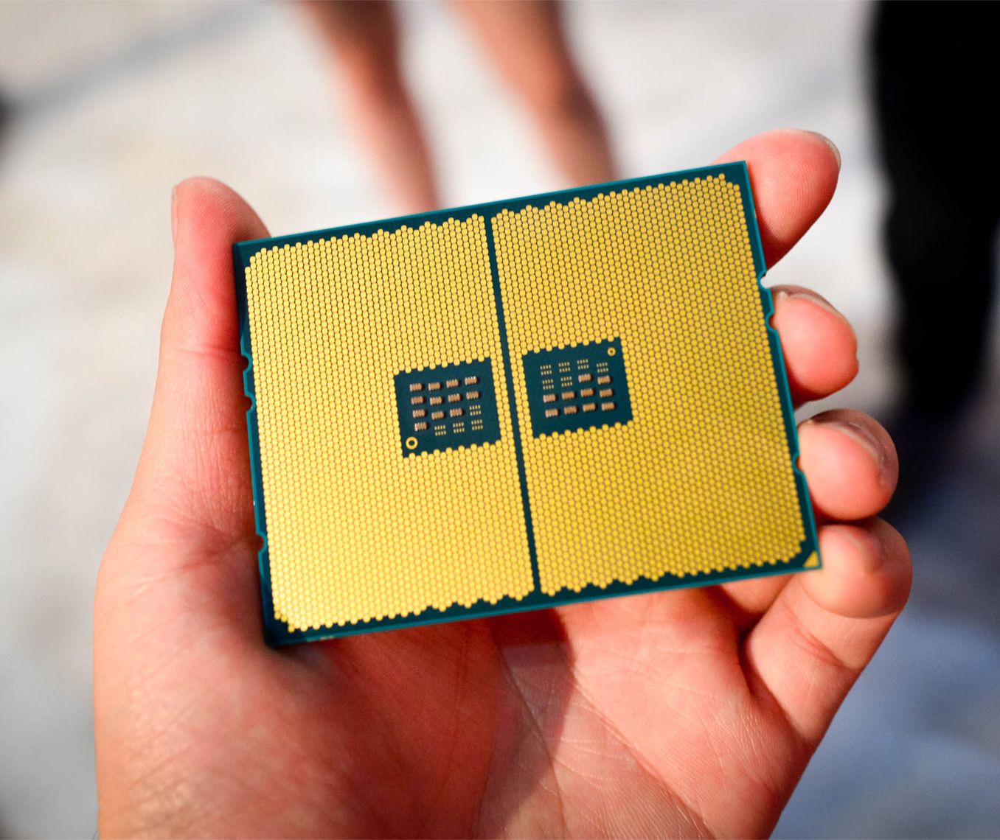

+++
categories = ["dreams", "AMD", "AMD-ryzen"]
date = 2022-03-01T07:49:00Z
description = ""
draft = false
slug = "a-cpu-nightmare"
tags = ["dreams", "AMD", "AMD-ryzen"]
title = "A CPU Nightmare"
[cover]
    image = "images/olivier-collet-JMwCe3w7qKk-unsplash.jpg"

+++

It was just another day, dreaming, in otherworldly adventures, but almost tearing up in my dreams was not what I expected.

I was casually sitting near my computer, just like any other evening, playing games and passing time; my CPU was set at a fixed overclock of 4.2 GHz all core to squeeze every ounce of performance I could from my hardware, for more context, this is the maximum clock speed that AMD considers to be in optimal working conditions. It gets pretty hot during demanding workloads even though it is liquid-cooled. I am a huge fan of server space computing and wish to set up a commercial-grade server at home sometime soon.

Ryzen 5 3600 vs Ryzen ThreadRipper 3990X Comparision (60 vs 250+ Watt TDP)

Due to these wishes back in my mind, boom, my consumer-grade CPU is replaced by a 36 Core Thread-Ripper, an absolute beast that consumes over 250+ watts of TDP (Total Power Draw). It's now also clocked at 4.2 GHz all core. I started the standard benchmarking software Cinebench, there was a sudden spike in temps as the cabinet began smoking. The CPU overheated, the CPU pins melted, and the motherboard was utterly destroyed. As we all know, CPUs don't like high temperatures for a sustained amount of time.

The motherboard was utterly destroyed, and the PSU (Power Supply Unit) became useless, too; considering the current silicon shortage, I panicked as I was sure that I would never be able to get another CPU and Motherboard at the market prices; I was scared that I wouldn't be able to play games and use my PC as before. I was overwhelmed, and I almost burst into tears just before I woke up and realized that it was just a dream. I stared and stared at my computer for a while; being thankful for the dream not coming to a reality, I brought my CPU to its default settings days later.

So that's all about the "THE CPU NIGHTMARE"Thank you for reading until the end, and see you next time.