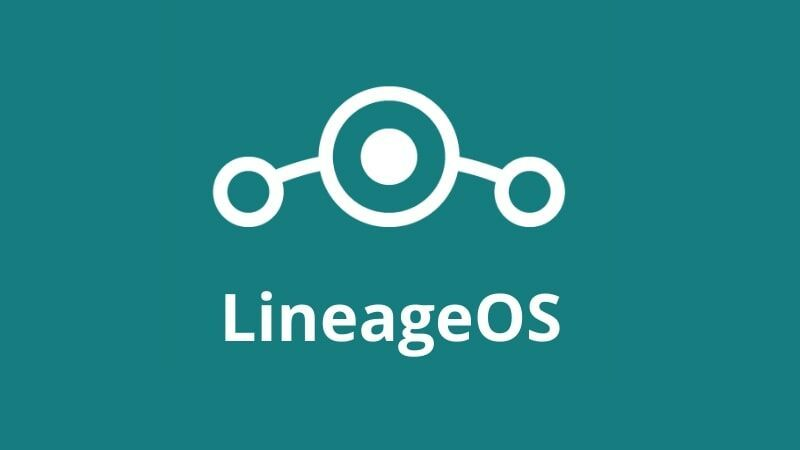

+++
categories = ["Android", "open-source", "Linux"]
date = 2022-01-20T13:56:14Z
description = ""
draft = false
slug = "aosp-and-custom-roms"
tags = ["Android", "open-source", "Linux"]
title = "AOSP and Custom ROMs"
[cover]
    image = "images/mika-baumeister-C4wFBBXRyyE-unsplash.jpg"

+++

All the phones that run Android as their Operating Systems (OS) are based on or are forks of the Android Open Source Project (AOSP). Initially intended to develop advanced operating systems for digital cameras due to lack of market, Android shifted to make Operating Systems for handheld mobile devices.

# Android Open Source Project

Android is very popular in the handheld mobile devices market; it is actively maintained and gets a major yearly release. As previously mentioned, every android phone is a fork / based on the AOSP project. The entire code for Android is available online for developers interested in using Android in their device of choice. If everything is AOSP based, what are Stock ROMs and Custom ROMs?

## Stock ROM

The OEM (Original Equipment Manufacturer) provides Stock ROMs for their users; it's what ships with the device. It is their version of AOSP. Some Stock ROMs are

* One UI - Samsung
* Oxygen OS - OnePlus
* MIUI - Xiaomi
* Color OS - OPPO

If you haven't heard about Custom ROMs, you're most probably on a stock ROM. These ROMs are tailored for the device by the manufacturer. The company maintains these ROMs and releases software and security updates via OTA (Over The Air) updates at their schedule, often releasing significant updates for 2-3 years on their flagship devices or just one year of software updates on their entry-level devices.

## Custom ROM

Custom ROMs are the Android OS (s) based on the AOSP project like the Stock ROMs. The OS is maintained by a single developer or a community of developers. Some of the popular Custom ROMs are

* Lineage OS
* Pixel Experience
* Evolution X
* Arrow OS

These ROMs are maintained by a community of passionate developers who maintain the ROM for their devices (device maintainer). Custom ROMs get monthly or bi-monthly builds that have updates that improve the device performance, add extra features or have the latest security patch. All the Custom ROM have one goal in mind: give clean, better, and performant software that utilises the system resources efficiently and to its maximum potential whilst giving the user a good amount of control over the look and feel of their device.

## Custom vs Stock ROM

Now that we know the fundamental differences between the two, why would you consider one over the other? While Custom ROM provides a lot of freedom to the user to modify their device considerably, it has some downsides. Before installing any Custom ROM, the device should have an unlocked bootloader. The bootloader is locked on all new devices for security reasons to prevent being damaged by unauthorised use or modifications. Many OEMs don't allow their users to unlock the bootloader for the aforementioned reasons. Some OEMs allow the unlocking of the bootloader, but you lose the device warranty and support. Suppose you are comfortable with losing device warranty and support. In that case, they're up for a wonderful experience that can change the look and feel of their device or brick the phone (making the device unusable), the latter of which is rare and only happens when the user follows a bad guide or do something they aren't aware of, or not supposed to do.

### Benefits of Custom ROM

There are many advantages to using a Custom ROM. Here are some of the most popular things that make Custom ROMs stand out and possibly motivate you to try something new as well.

#### Remove spyware and bloatware

Many stock ROMs ship with unnecessary applications or just plain junk apps that serve no use other than to waste system resources and make the device laggy. OEMs that sell their devices at low and aggressive prices to beat their competition don't have high-profit margins. They try to recoup the cost by collecting and sharing user data with ad agencies, showing us ads in the System UI or in applications like shopping apps and free games that influence our decisions. Isn't that creepy? Many also ship with uninstallable apps like google or their proprietary apps. Custom ROMs come with bare minimum google apps. Vanilla versions have no google apps whatsoever; install google apps that you need or just install open-source apps and never use google apps again, amazing isn't it?

#### Extended Software Update Cycle and Security

Major Android updates are released for about 1-2 years after the initial device release before the manufacturer abandons the device. Looking from the OEM POV (Point Of View), it is a way to keep users new products and generate revenue new revenue. Users use their devices for an extended period due to few updates for their device is vulnerable to malware. OEMs refuse to provide updates for an extended period irrespective of the device price segment. Custom ROMs offer extended software support for their supported devices; some devices have more than three years of software updates, these devices are less than 15000 INR. Isn't that amazing?

#### Customisations

A Custom ROM gives its users complete access to change the look and feel of the device. You can expect to change the font, accent colour, icon shapes, device animations and add custom icon packs and launchers. Although OEMs are allowing some modifications to their devices nowadays, there isn't much that we can change or experiment with as they go for a consistent look and feel for all their devices. Many custom ROM provides a fully customisable experience that makes your phone truly yours.

#### Performance

Custom ROMs aren't limited to software changes alone. You are free to change things that run at a hardware level too. AOSP is based on the Linux Kernel, the largest open-source project. Most Custom ROMs ship with a kernel from the AOSP project or a kernel modified to meet the requirements and the ideology of the developer or the developers working on the custom ROM. If you feel that the stock kernel (kernel that ships with the custom ROM) doesn't satisfy your needs like peak performance or better battery life, you can always flash / install a different kernel that meets your requirements. Some of the popular kernels are

* Franco Kernel
* ElectraBlue Kernel
* ElementalX Kernel
* Vantom Kernel

Each kernel has its unique offerings. Few focus on stability and battery life for those who forget to charge their phones or forget their chargers. In contrast, others focus on best performance, such as overclocking the SOC and the display, which is favourable to mobile gamers who need the best performance while playing games.

## Custom ROM isn't Custom Enough?

Not all Custom ROMs are built to meet everyone's needs. Are you tired of finding the Custom ROM that fits your requirements? Want to explore the android system? Why not make a Custom ROM for yourself. If that question is in your mind, the answer is a yes. The AOSP provides extensive documentation, an excellent guide, and the minimum hardware requirements to get started with android development.

What will you do? Install custom ROM? or a build one for yourself?. Regardless of what you do, it's a great learning experience to know the phone we always have with us. I'm off installing a Custom ROM on my phone. See you next time.~ Kalyan Mudumby