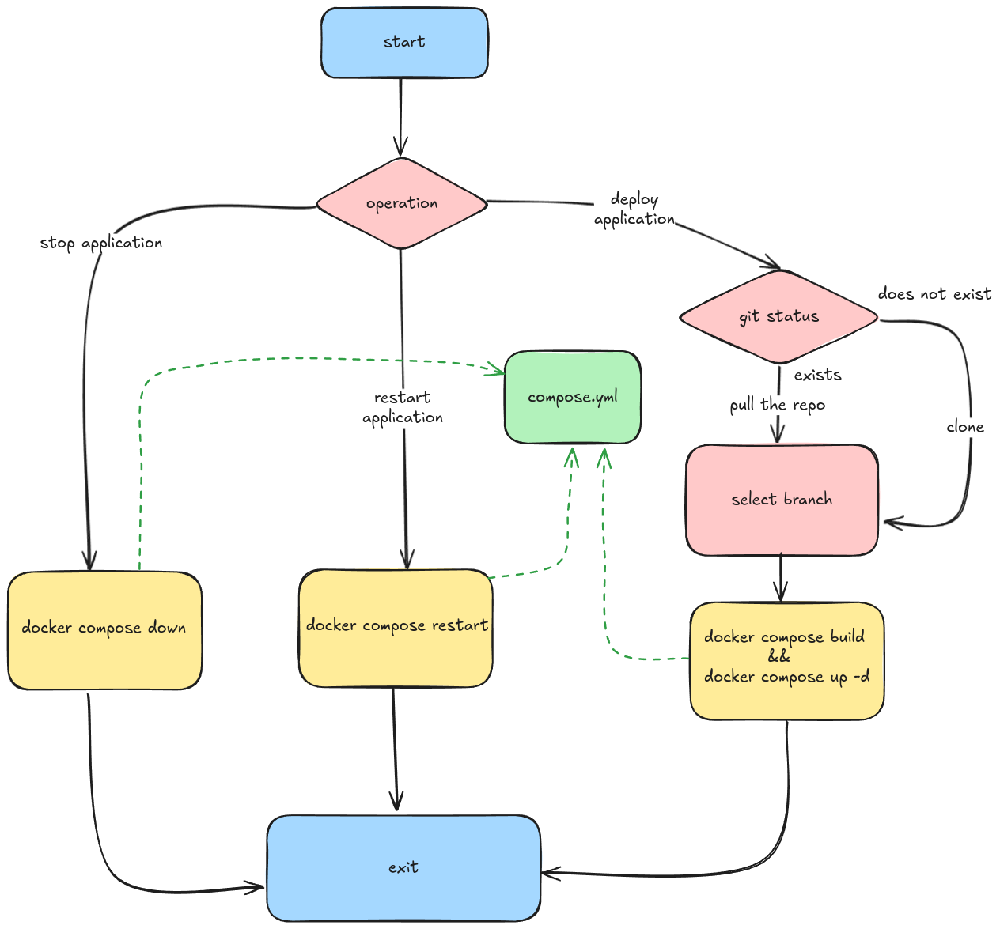
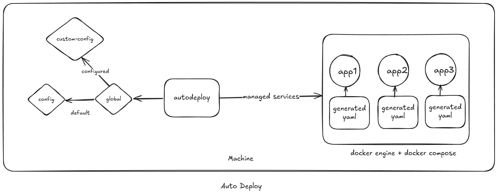

# Why Autodeploy?
In a fast-paced environment where multiple teams push new code to add functionality and integrate with other components, the feedback loop should be quick. This promotes rapid testing and iteration, helping us release our product to market as soon as possible.
While building and deploying applications in the cloud can be quick, it often comes with unnecessary costs.

Building in a local environment has several advantages:
1. No fear of failure, encouraging the confidence to fail fast
2. Connection to the local intranet
3. Cost savings from using on-premises machines for compute rather than cloud resources

Autodeploy is a drop-in replacement for a bash script that previously managed local deployments on a Linux server.

## Old workflow



The following tasks were handled by the bash script. This was the first bash script I had written, and it could automate many things for me and my colleagues. However, there were some drawbacks:

The list of projects had to be hardcoded
Docker Compose YAML files had to be manually generated for all projects
Not everyone needed to know Docker Compose specifications and bash

Although it was mildly configurable, a lot of manual work was required every time to keep things running smoothly.
## New Workflow
To improve on the older flow, I needed to ensure that I could set up a Linux machine with all required projects in minimum time and with 100% reproducibility. The new workflow had to be machine-agnostic and highly configurable.

I decided to maintain a TOML file that would be user-configurable, allowing us to define as many tables as required for projects, including the necessary configuration for Docker containers. This configuration-based approach allows us to generate Docker Compose specification files at runtime as defined. There would be a single file to manage all projects and their Docker configurations.

### Example configuration:

```toml
# DISCLAIMER:
# Optional configiration are required to be
# deleted before running the application

path = "./repos"

# --------- EXAMPLE ---------
[[application]]
name = "EXAMPLE"
# name of the directory where the repo will be cloned into
# $(pws)/repos/example
directory_name = "example"
url = "https://example.com"

[application.container]
name = "example"
image = "example"
restart_policy = "example"
ports = ["8080:8080", "9090:9090"]
volumes = [
    "xyz:zyx",
    "abc:cba",
] # optional For host path mapping use absolute paths
environment = ["KEY=VAL", "KEY=VAL"] # optional
standard_in = false # optional
interactive = false # optional
docker_user_group_id = "1000:1000" # optional

[application.container.build]
dockerfile = "Dockerfile"
build_args = ["KEY=VAL", "KEY=VAL"] # optional
```

The optional fields would be omitted in the generated Docker Compose specification file. The main advantage is that you can switch between complete projects just by changing which user configuration the master config should point to.

Using the git2 crate, we can use Git bindings in Rust programmatically. The inquire crate enables us to create an interactive UI in the terminal. The final output would be a binary containing vendored Git and OpenSSL, meaning that the target machine doesn't even need to have Git and OpenSSL installed, as the Rust binary is self-contained.

This approach simplifies deployment, improves reproducibility, and makes it easier for team members with varying levels of Docker and bash expertise to manage projects effectively.

### Application Design


The Autodeploy binary locates and validates the main and project configuration files, then presents an intuitive interactive UI for seamless project management and deployment.

A single binary to rule them all.

[**sourcecode**](https://github.com/theinhumaneme/autodeploy) for autodeploy, if you have any new ideas, you can raise a Pull Request and I would be happy to merge it :D


## But, why Rust?

While there wasn't a compelling technical reason to choose Rust for this project, it presented an excellent opportunity to dive deeper into the language. Autodeploy became a playground for exploring Rust's Syntax and it's robust type system.


Thank you for reading until the end.
