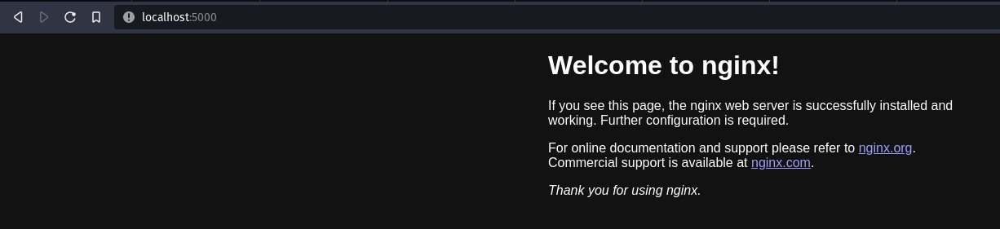
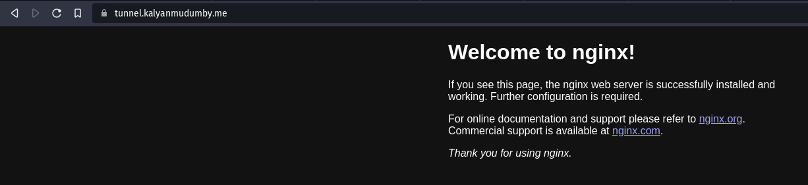

In the past few months, I have been interested in making a small home lab, trying out some self-hosted services on my Raspberry Pi 4, and occasionally hosting some of my projects. Some of the most popular self-hosted services are 
- Nextcloud - Alternative to Cloud Storage Services 
- Jellyfin - A Home Media Server with some awesome features
- A Visual Studio Code Server

But to do all of this and access my applications remotely, I need

- A public-facing IP address
- A server in the cloud or at home


Using a Public IP address is very risky. Without a good network and firewall setup, I could expose my home network to malicious hackers and make my home network compromised and vulnerable. This is not a safe option.

How about renting a VPS from an online Cloud Provider could be an option, but considering that you need to host Nextcloud and Jellyfin Instances, which have high storage and RAM requirements, this option gets expensive really quick, not to mention that the basic servers don't have enough computer power to transcode the video files on the fly. Paying large sums of money for Hobby and Fun Projects doesn't sound very good, does it?

Many of the Homelabs that are generally set up are based on an old retired computer or a Raspberry Pi, which are dedicated to running such instances; we need a public IP to access the services hosted on our local network remotely. Sometimes we would like to expose just one service or share access to an application with our friend or colleague for demo and testing purposes. But... can we do it?

Cloudflare Tunnels make it possible to expose our applications in our local network to be connected from a public DNS record linked to our domain.


# How do they work?

Cloudflare tunnels work by installing an application or a Cloudflare service called Cloudflared; this service creates a reverse tunnel that communicates with the Cloudflare Servers and connects with the nearest Cloudflare Datacenter. This establishes a secure connection between Cloudflare and our local machine. Now our device can communicate with Cloudflare, let's create a tunnel and expose a test application to the public internet.


# How to use CloudFlare Tunnels

We can use tunnels to direct HTTP RDP SSH and SMB traffic from our applications via the tunnel; this is helpful when you need to have remote access to your system and expose a SAMBA Share, which is some of the common use cases. In this blog post, we are going to expose an NGINX server for demo purposes

To follow along with me, you need to do the following.

- A domain registered to you or have access to
- Change Nameservers from your domain registrar to Cloudflare
- In Zero Trust Portal, verify your account using a valid credit card

# Cloudflared Install and Setup

Cloudflared can be installed in two ways

- Via the Dashboard
- Via the Command Line

The dashboard method is easy, we create a tunnel in the portal, and the website provides us with the commands to install and set up the Cloudflared service on our machine; if we set up a tunnel via the CLI, it can be configured through CLI only, and not via the Dashboard, we can migrate the CLI config to the Dashboard if we wish to.

## Installing Cloudflared

Cloudflared is available for the following Operating Systems and Platforms.

- Linux
- Docker
- Windows
- MacOS

For Linux, the following Architectures are supported.

- amd64/x86-64
- x86 (32 Bit)
- ARM (32 Bit)
- ARM64

Use the following command to install Cloudflared.
replace `$ARCH` with the arch of your current system

```bash
wget -q https://github.com/cloudflare/cloudflared/releases/latest/download/cloudflared-linux-{$ARCH}.deb && dpkg -i cloudflared-linux-{$ARCH}.deb

```

## Authenticate Cloudflared

Cloudflared is now installed and must be linked with our account by authenticating our installation.
Ensure you are logged into your Cloudflare account in your default browser.

```bash
cloudflared tunnel login
```

Authorize the domain you wish to use in the browser for tunnels; after the login, the credentials are installed at `/home/kalyan/.cloudflared/`

The output should be similar to

```bash
A browser window should have opened at the following URL:

https://dash.cloudflare.com/argotunnel?aud=&callback=https%3A%2F%2Flogin.cloudflareaccess.org%<STRING>

If the browser failed to open, please visit the URL above directly in your browser.
2023-05-20T13:55:25Z INF Waiting for login...
You have successfully logged in.
If you wish to copy your credentials to a server, they have been saved to:
/home/kalyan/.cloudflared/cert.pem
```

## Create a Test Application (NGINX)

To verify that the tunnel can route our local application traffic, we can use a simple web server like NGINX, as it has a default webpage on page load. Specifically, a docker container will be created with an NGINX image, and ports will be mapped on the host machine to the docker container.

To install docker if not already installed.

```bash
sudo apt update && sudo apt install docker.io
```

To create an NGINX docker container

```bash
docker run --name tunnel-nginx -p 5000:80 --detach nginx:latest
```

This command will pull the `nginx:latest` image if it does not exist locally, names the container `nginx-tunnel`, maps the host port `5000` to port `80` of the container, and runs in detach mode (background).

The output should be similar to

```bash
Unable to find image 'nginx:latest' locally
latest: Pulling from library/nginx
9e3ea8720c6d: Already exists
bf36b6466679: Pull complete
15a97cf85bb8: Pull complete
9c2d6be5a61d: Pull complete
6b7e4a5c7c7a: Pull complete
8db4caa19df8: Pull complete
Digest: sha256:480868e8c8c797794257e2abd88d0f9a8809b2fe956cbfbc05dcc0bca1f7cd43
Status: Downloaded newer image for nginx:latest
f1dcf6b38cdef4a4bda91ef6eb99f9223c7c7b7cd3e0a431ffcd17601be5f425
```

Check for running docker containers using the command `docker ps` or `docker ps -a' for all running and stopped containers.

```bash
CONTAINER ID   IMAGE          COMMAND                  CREATED         STATUS         PORTS                                   NAMES
f1dcf6b38cde   nginx:latest   "/docker-entrypoint.…"   2 minutes ago   Up 2 minutes   0.0.0.0:5000->80/tcp, :::5000->80/tcp   nginx-tunnel
```

Let's verify if we can access the nginx server from `http://localhost:5000`



We now have a simple web server running at port 5000; let's route the traffic from this application using tunnels.

## Tunnel Creation and Configuration

Let's create our first tunnel using the following command.

```bash
cloudflared tunnel create nginx-tunnel
```

The output should be similar to

```bash
Tunnel credentials written to /home/kalyan/.cloudflared/25848586-e508-42f8-be78-84e13328fa46.json. cloudflared chose this file based on where your origin certificate was found. Keep this file secret. To revoke these credentials, delete the tunnel.

Created tunnel nginx-tunnel with id 25848586-e508-42f8-be78-84e13328fa46
```

Let's configure the tunnel by creating a configuration file `nginx-tunnel.yml` at `/home/$USER/.cloudflared/` directory and add the following lines, replace `<UUID>` with from the previous command output, replace `<domain>` with your domain.

```bash
---
tunnel: {UUID}
credentials-file: /home/{USER}/.cloudflared/{UUID}.json
ingress:
  - hostname: tunnel.<domain>
    service: http://localhost:5000
  - service: http_status:404
```

Our tunnel is now created, now we need a public DNS record that can point to our application through the tunnel; this can be done via the CLI where Cloudflare automatically makes a DNS record for us and points to towards a `cfargotunnel.com` subdomain created for our tunnel.

```bash
cloudflared tunnel route dns nginx-tunnel tunnel.<domain>
```

Our tunnel is now ready and configured. Let's run the tunnel!!


## Run the tunnel

Cloudflared needs to know the config that has to be used; our config is located at `/home/{USER}/.cloudflared/{tunnel-name}.yaml`

Let's pass this path to the tunnel by using the flag --config

```bash
cloudflared tunnel --config /home/$USER/.cloudflared/{tunnel-name}.yaml
```

The Nginx server at `tunnel.<domain>` should now be accessible from the public internet; let's verify if we can connect to our local Nginx server via Cloudflare Tunnels.



It works, we were able to send a request to our nginx server over the public internet through Cloudflare tunnels.

# Conclusion

We successfully exposed our simple web application to the internet using Cloudflare tunnels securely via a public DNS record. Our use case of tunnels was very basic; Cloudflare tunnels have many advanced uses; you can also expose a private network using Cloudflare WARP and Cloudflare Access using Tunnels. You are now ready to host your applications and access them remotely. I hope this post helped make in making your first Cloudflare Tunnel

Visit [Cloudflare Zero Trust](https://developers.cloudflare.com/cloudflare-one/) to learn more about Cloudflare Tunnel.

Thank you for reading

~ Kalyan Mudumby

