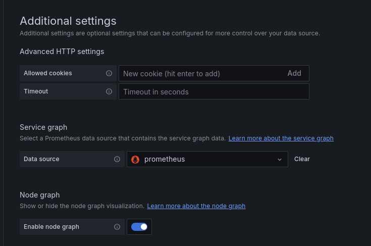
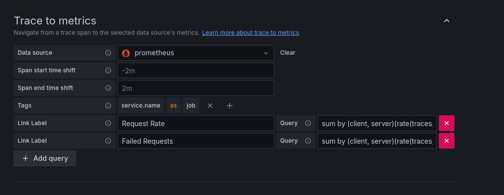
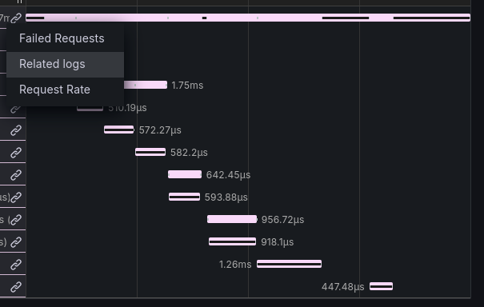
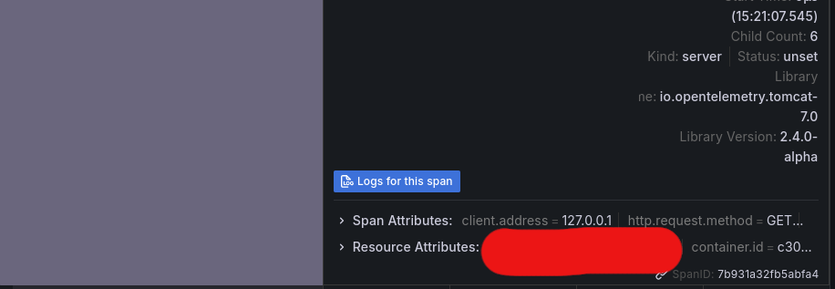
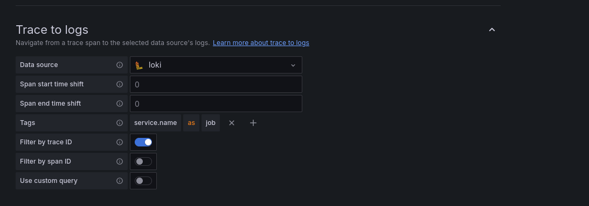
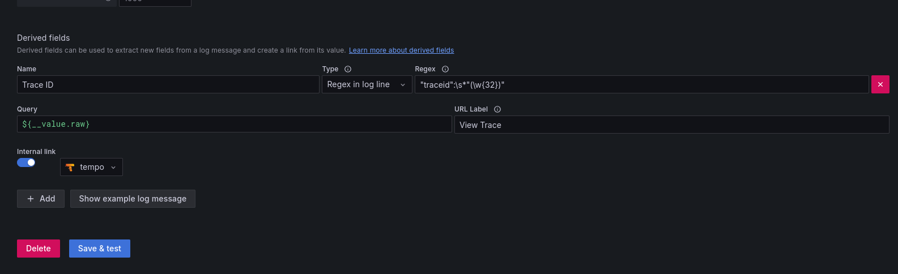
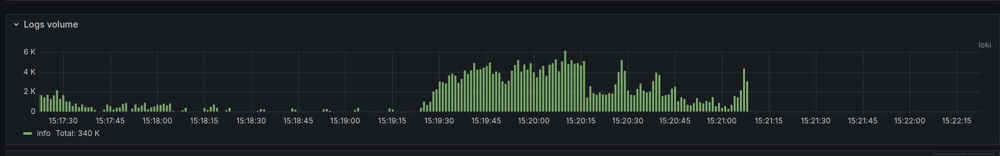
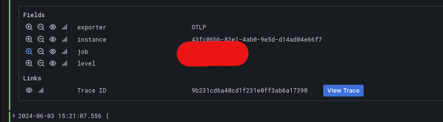

# Complete Observability for your Springboot Applications

There are three pillars of observability of an application

* [Monitoring](#monitoring)
* [Tracing](#tracing)
* [Logging](#opentelemetry)

before integrating these tools into our applications, it is crucial to understand these tools and the purpose they will serve throughout the application lifecycle.

## Monitoring

Monitoring can be summarized simply as collecting information from the application at regular intervals of time to analyze trends to understand the load and behaviour of the application in a given time frame or during a stage in the application development.

Here are common metrics:

- CPU Usage
- Memory Usage
- Disk Usage
- Requests Received
- Network  In
- Network Out

Depending on the Programming Lanuguage, Application and the framework being used, you can extract more detailed and granular information from the above mentioned list, you can also make your own custom metrics to analyze certain tasks which are necessary to monitor.

## Tracing

Tracing are a way to record and mointor a user's actions, whenever we talk about tracing it is usually about distributed tracing. In distributed tracing we can track the lifecycle of the entire request triggerd by a user's action and all the other request which we invoked during it's execution. This would involve by assiging the request with a trace ID. Using this unique trace identifier the observability platfrom is able to track and mointor it as it propagtes through our environment.

It is important to note that if the frontend is not equipped with the tracing support we would only be able to monitor the application from the moment it interacts with our backend service.

Tracing enables us to

- measure latency from request to response
- mesure resources used by certain routes or functions.
- measure time spent at each function or API call.

This amount of information when visualised with a tool like grafana allows us to find patterns and identify bottlenecks within our application and environment

## Logging

Logging is the the act of maintaining the order of all the historical events that happen within the application. These are time stamped and have information sorted by the level of information of severity.

This allows developers to understand the series of events that happened that led to an unwanted response or worse a system breakdown.

## OpenTelemetry

Sample config file to start the [[OpenTelemetry#Collector]] and enable [[Tempo]] [[Loki]] and [[Prometheus]] along with [[Grafana]] for visualization

to enable the [Micrometer Application Observabilty](https://micrometer.io/) we need to add the springboot actuator and the micrometer registry to our dependencies, here's the one for maven.

```xml
<dependency>  
    <groupId>org.springframework.boot</groupId>  
    <artifactId>spring-boot-starter-actuator</artifactId>  
</dependency>  
<dependency>  
    <groupId>io.micrometer</groupId>  
    <artifactId>micrometer-registry-prometheus</artifactId>  
    <scope>runtime</scope>  
</dependency>
```

To enable the application metrics to be collected we need to add the OpenTelemetry Java agent to the application, this can be done by passing the path to the jar file in the application, here's the Dockerfile for a war application, refer to [Application Server Configuration](https://opentelemetry.io/docs/zero-code/java/agent/server-config/) for jar files it is well documented

```Dockerfile
FROM maven:3-eclipse-temurin-11 as build  
WORKDIR /APPLICATION  
COPY pom.xml .  
RUN mvn dependency:resolve  
RUN mvn dependency:resolve-plugins  
COPY . .  
ARG ENV="development"  
RUN echo $ENV  
RUN if [ "$ENV" = "production" ] ; then mvn clean install -Pprod.application ; elif [ "$ENV" = "staging" ]; then mvn clean install -Pstaging.application ; else mvn clean install -Pdev.application ; fi  
RUN mv /APPLICATION/target/APPLICATION-SNAPSHOT.war /APPLICATION/target/APPLICATION.war  
FROM tomcat:9-jdk8-openjdk  
RUN wget -O otel.jar  https://github.com/open-telemetry/opentelemetry-java-instrumentation/releases/download/v2.4.0/opentelemetry-javaagent.jar  
COPY conf/server.xml /usr/local/tomcat/conf/server.xml # if you have a custom tomcat server file
# CONFIGURABLE  
ENV SERVICE_NAME="OPTIMUS"  
ENV CLIENT_NAME="EARTH"  
ENV INGESTOR_ENDPONT="https://<OPENTELEMETRY-COLLECTOR-HTTP-ENDPOINT>"  
# DO NOT EDIT  
ENV OTEL_EXPORTER_OTLP_ENDPOINT=$INGESTOR_ENDPONT  
ARG ENV="development"  
RUN echo $ENV  
ENV OTEL_RESOURCE_ATTRIBUTES="service.name=$SERVICE_NAME-${ENV},environment=${ENV},client=$CLIENT_NAME"
ENV OTEL_TRACES_SAMPLER="always_on"  
ENV OTEL_INSTRUMENTATION_MICROMETER_ENABLED=true  
ENV OTEL_INSTRUMENTATION_COMMON_DB_STATEMENT_SANITIZER_ENABLED=true  
ENV OTEL_INSTRUMENTATION_LOGBACK_ENABLED=true  
ENV OTEL_METRIC_EXPORT_INTERVAL=10000  
ENV OTEL_METRICS_EXEMPLAR_FILTER=ALWAYS_ON  
ENV CATALINA_OPTS="-Dhttps.protocols=TLSv1.2"  
ENV CATALINA_OPTS="$CATALINA_OPTS -javaagent:otel.jar"COPY --from=build /APPLICATION/target/APPLICATION.war /usr/local/tomcat/webapps  
CMD ["catalina.sh", "run"]
```

This is a multi stage docker build file which attaches the agent during runtime with some default configuration

config files

![[docker-compose.yaml]]

![[otel-collector.yml]]

![[tempo.yml]]

![[loki.yml]]

![[prometheus.yml]]

![[SpringBoot Observerability.excalidraw | 100%]]

The above image shows the ideal system design, where we have persistent storage configured, but the one thing which I would like to change is that, make Prometheus a push based receiver than a pull based receiver, I have configured as pull based here for ease of configuration and so that we can get up and running with the usual application defaults.

After we have a default demo application running, we can check if the application metrics are being pulled at the Prometheus Web UI `http://localhost:9090` here you can check if all the [[Micrometer]] metrics data are being pulled/scraped or not, once this is confirmed we can proceed with the Grafana setup.

## Visualization Setup

Access the Grafana instance at `http://localhost:3000` the default username and password is **admin** **admin** .

Lets add our first data source which is Prometheus from the left pane, the address for the source would be `http://prometheus:9090` as we can access the Prometheus container from the docker network and the container address will be resolved by the Docker Network.

After this we would like to visualize the metrics data through a Grafana Dashboard, using the PromQL, but we can use an existing dashboard made by the community for Spring Boot Micrometer Metrics, In the dashboards choose import Dashboard and enter the id `12900` , select the newly added Prometheus data source as the data source. we should now be able to see the application metrics in some really beautiful graphs.

For Tempo Traces, add Tempo as the data source with the URL as `http://localhost:3200` after which you can explore all the traces with Tempo Search or TraceQL

For Loki Logging, add Loki as the data source with the URL as `http://loki:3100` after which you can explore all the logs with with Loki Search or LogQL

This concludes the basic setup.

### Enabling Service Graph and NodeGraph

Under Tempo Data source Additional Settings, you can enable the service graph, choose Prometheus as the Data source, we can also enable Node Graph while we are at it.

To use these graphs you need to have spanmetrics enabled tempo metrics generator, which we already have enabled in our tempo configuration file.



## Tempo Traces to Metrics

We can also see the metrics for a particular trace by configuring Traces to Metrics in the Tempo Data Source settings, here we can add two basic queries which can be of help.

Under tags add `service.name` as `job`

add the following two queries for

* Request Rate - `sum by (client, server)(rate(traces_service_graph_request_total{$__tags}[$__rate_interval]))`
* Failed Request Rate - `sum by (client, server)(rate(traces_service_graph_request_failed_total{$__tags}[$__rate_interval]))`

It should look something like this



Now when you view a trace you should be able to see a link logo icon, under which you should see the two queries which we have written, clicking on which you can see graph related to that trace, which looks amazing, this is the trace to metrics now let's look at trace to logs





### Tempo Traces to Logs

Just above ***Trace to Metrics*** you should be able to see Trace to logs, select Loki as the Datasource and under tags just like tempo set `service.name` as `job`



it should look something like this, now on each trace and span you can see the button see **related log** button you should also be able to see a link under the link icon

## Loki Logs to Traces

We have seen that we can go from Tempo Traces to Metrics and Logs, that would be useful when you want to see the logs of the requests that are slower than expected what if, you want to see the request and the flow of a error message which you cant seem to figure out?

Here comes Loki Logs to Tempo Traces

In Loki Datasource settings add a derived field, enable the internal link button choose tempo datasource and add the following

* Name : `Trace ID`
* Type: Regex in Log Line
* regex: `"traceid":\s*"(\w{32})"`
* Query: `${__value.raw}`
* URL Label: `View Trace`



This is the logging view on the Loki Explore page



Choose any of the bar and the log from the list, scroll down to find the Fields and Links section to find the following link.



## References

-
