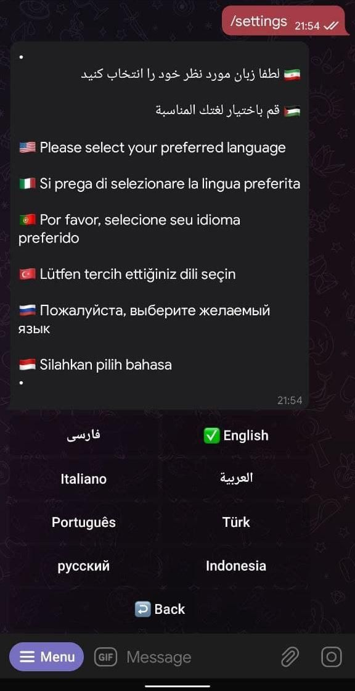
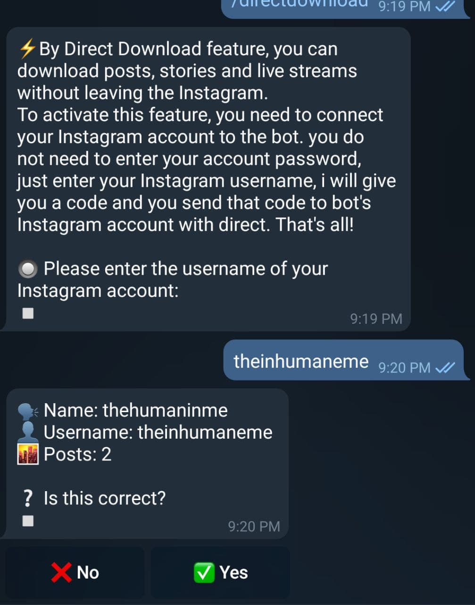
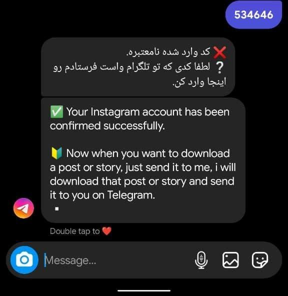

+++
categories = ["Telegram", "telegram-bot"]
date = 2021-10-21T13:33:02Z
description = ""
draft = false
slug = "download-instagram-and-reddit-posts-through-telegram"
tags = ["Telegram", "telegram-bot"]
title = "Download Instagram and Reddit posts through Telegram"
[cover]
    image  = "images/create-a-telegram-bot-for-instagram-engagement-1200x675-1.jpg"

+++

# Content Download Bots

Instagram and Reddit are two platforms among the many out there where many **Terabytes** or **Petabytes** (_1024_*_Terabyte_) are uploaded by the users to the platforms, there must have been times when we wanted to download a video / image from such platforms, we tend to go for websites to download our video / image, but you don’t have to go through all the trouble anymore, The Bots discussed in this Post will ease up that process for you and you can share videos / images with your closed ones

## RegramBot

Regrambot is the Telegram bot that interacts with InstagramThe way Regrambot works is it will create an internal authentication with your Telegram account and your Instagram account, just to be clear this is in no way an OAuth So now lets see how to link our authorize your Telegram account with Instagram

### Step 1: Start the bot

[**Link to RegramBot**](https://t.me/Regrambot) or search for **@Regrambot** in Telegram inbuilt search

### Step 2: Connecting our account

After you start the bot it will ask for your preferred language I choose english in this tutorial but you can choose your preferred language

To connect our account, issue the command `/directdownload` to the bot,the bot will now ask you to enter your Instagram username in the text field, confirm your account details given by the bot

After this process you will get a confirmation `code` which you have to sent to this [account](https://www.instagram.com/regrambotpage/) on instagram via Direct MessageOn Succesful Confirmation you’ll get a message something similar to this on **Instagram** and the next image on **Telegram**

Now we are all set to download **videos / posts / reels / stories** from Instagram

Lets see a live demonstration here

