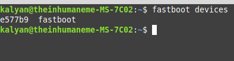
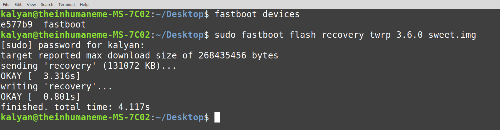
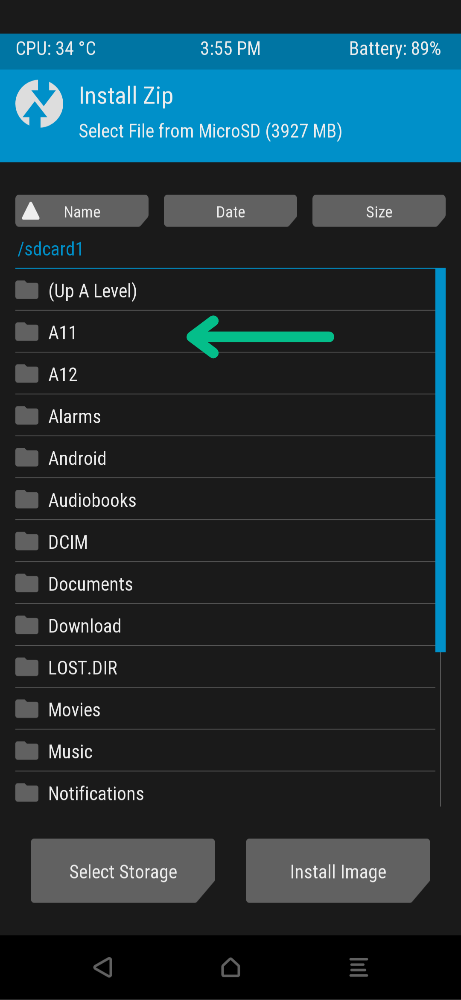
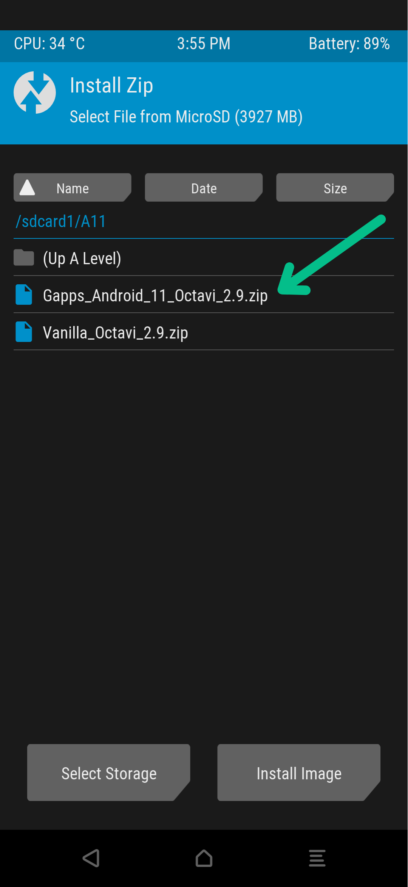
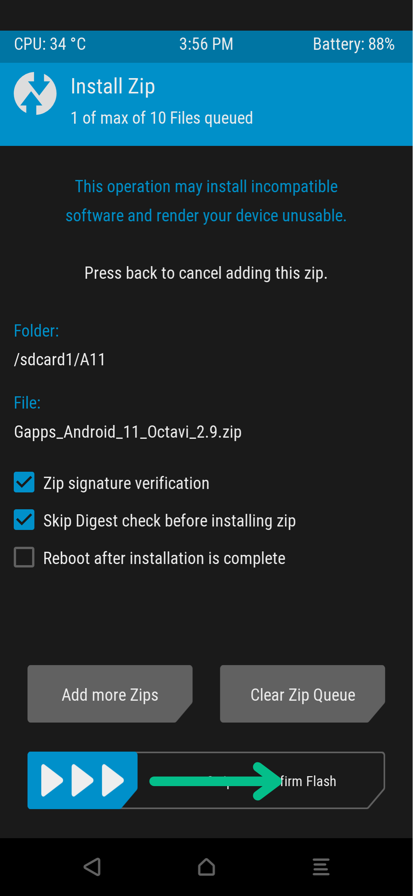
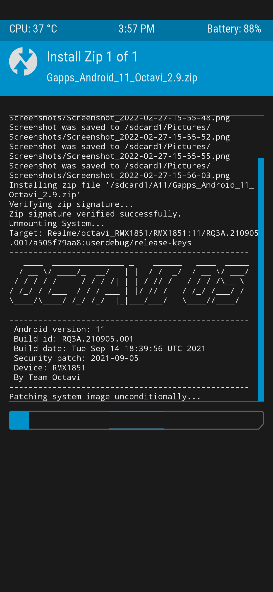

+++
categories = ["android", "linux", "open-source"]
date = 2022-02-27T16:56:58Z
description = ""
draft = false
slug = "lets-install-a-custom-rom"
tags = ["android", "linux", "open-source"]
title = "Let's Install a Custom ROM"
[cover]
    image = "images/adrien-K12SrkaZuCg-unsplash.jpg"

+++


Today we'll be installing a Custom ROM on any Android Device !! I'm so excited to see and feel my phone differently. Does Custom ROM feel unfamiliar to you? Read more about Custom ROMs [Here](https://kalyanmudumby.com/post/aosp-and-custom-roms/). We'll be using Realme 3 pro (RMX 1851), Redmi Note 10 Pro (Sweet / Sweetin)

# Disclaimer

I take no responsibility for any damage from installing or using a Custom ROM by following this guide/post.

# Pre - Install

A few things should be ready before we install any Custom ROM.

## Unlocking the Bootloader

The bootloader is a vendor-specific image that brings up the kernel on the device. It guards the device state and protects the device from any modifications being made at the hardware level; the bootloader is almost always locked on most devices for security and after-sales services, companies don't want users tinkering with their devices, and in areas, it wasn't designed and intended for, it's easier to repair any phone when it's in its default/factory sate. Companies such as Xiaomi, Redmi, Realme, Oneplus, Google allow the unlocking of the bootloader and enable their users to tinker with their devices. To unlock the bootloader Xiaomi and Realme offer an application to initiate the process of unlocking the bootloader, which is vendor-specific. In most cases Unlocking the bootloader voids the device warranty as now the device is out of the intended optimal operational conditions, it was designed for. To regain the warranty, we can simply lock the bootloader generally, which again can be vendor-specific. There are different ways to unlock the bootloader of diff vendor phones; there are plenty of resources on the internet on this process.

## Installing a Custom Recovery Environment

#### What's a Recovery Environment?

A Recovery is a very minimal, limited software that allows us to format our device, flash OTA updates and ROMs provided by the manufacturer, not third-party Custom ROM.SA custom recovery has additional benefits over the stock recovery. It allows us to install third-party ROMs kernels, gain root access to our device and even create and restore complete backups of our phone? Ain't that amazing? We're essentially replacing the factory default / stock-recovery by installing the custom recovery.

#### Download a Custom Recovery

There are many Custom Recoveries available for one device; some of the popular ones are [TWRP](https://twrp.me/) (Team Win Recovery Project)and [OrangeFOX](https://orangefox.download/); many prefer using the TWRP recoveries as they roll out timely updates and has been in use for a very long time, we will be using TWRP today. Download the latest recovery file from the TWRP using your device name or device code name, Example: sweet, [recovery-image](https://twrp.me/xiaomi/xiaomiredminote10pro.html) for my device. You should find a recovery image for your device as well. Recoveries are device-specific and are not cross-compatible.

#### Install a Custom Recovery

We will need a PC / Laptop with _fastboot and ADB Drivers_ installed for this process. I will be using a Linux based machine as installing these drivers is as easy as one line of code. Rename your recovery file to `recovery.img`. All the commands must work on Windows machines too.

Use this command to install fastboot and ADB drivers on Debian based Linux Distributions that use APT as their package manager.

```bash
sudo apt-get install android-tools-adb android-tools-fastboot
```

Connect your phone via USB to your laptop/PC and enter fastboot mode, open the terminal and use this command to find your device

```bash
sudo fastboot devices
```

You'll see something similar to this output.



flash the custom recovery using this command

```bash
sudo fastboot flash recovery <filename>.img
```

output for the above command



We're now all set to install a custom ROM on our device

# Download and Install Custom ROM

Search for popular Custom ROMs for your device and download them on your device. There are two ways to install Custom ROM.

* via Command Line (Requires PC / Laptop)
* via Recovery

## via Command Line

Open the terminal in the directory where you have downloaded the custom ROM. Via the recovery, enter the ADB Sideload Mode. Use `adb devices` command to find your device; you're good to go if there is an output.

#### Vanilla Version

Download the Vanilla Custom ROM and the preferred Gapps Package by the Developer (Contact Dev, Community, Google Search) if you wish to use Google Services.

Use this command to install the Custom ROM.

```bash
# Install Custom ROM
sudo adb sideload <filename_Custom_ROM>.zip
# Install GApps Package (Ignore if you don't require Google Services)
sudo adb sideload <filename_GApps>.zip
```

#### GApps Version

Download the GApps Verison of the Custom ROM, open the terminal in the folder where the file is located using the command.

```bash
# Install Custom ROM GApps Version
sudo adb sideload <filename_Custom_ROM_GApps>.zip
```

**FORMAT DATA TO AVOID BOOTLOOPS (IMPORTANT)**

`RECOVERY -> WIPE -> FORMAT DATA -> YES -> CONFIRM`

## via Recovery

#### GApps Version

via the recovery, navigate to the folder where the Custom ROMs are located.






#### Vanilla Version

via the recovery, navigate to the folder where the Custom ROM and GApps Packages are located, follow the same steps as above. After the flashing of the Custom ROM, navigate to the same folder `Select GApps Package -> Swipe to Flash`

**FORMAT DATA TO AVOID BOOTLOOPS (IMPORTANT)**

`RECOVERY -> WIPE -> FORMAT DATA -> YES -> CONFIRM`

Now reboot to the system. If we followed all the instructions correctly, we should see a boot animation and boot into [OctaviOS](https://octavi-os.com/).

# Post Install

If you're in the post-installation process, congratulations, you've installed a Custom ROM successfully. Install all the necessary apps, use Saftey Net App to check if your device can use Banking Applications. You're good to go. I'm off to customize my phone, install some modded apps, and make my phone truly my own.

Thank you for reading until the end, and see you next time.
