+++
categories = ["linux", "cloud", "open-source", "raspberry-pi"]
date = 2022-03-31T15:59:32Z
description = ""
draft = false
slug = "lets-install-pihole"
summary = "Let's install an AdBlocker with PiHole -  a DNS level AdBlocker. A safer and better home network for our family and friends"
tags = ["linux", "cloud", "open-source", "raspberry-pi"]
title = "Let's Install an AdBlocker with PiHole"
[cover]
    image = "images/Pi-hole.jpg"


+++


# What's PiHole?

[PiHole](https://pi-hole.net/) is a DNS level AdBlocker that can also function as a DHCP (Dynamic Host Client Protocol) Server that runs on all Linux machines. It can block almost all advertisements on network devices. Created by [Jacob Salmela](https://jacobsalmela.com/) as an open-source alternative to [AdTrap](https://www.kickstarter.com/projects/600284081/adtrap-the-internet-is-yours-again#:~:text=What%20is%20AdTrap%3F,and%20websites%2C%20all%20ad%20free.) in 2014.

# Why PiHole?

Do you use a browser extension to block those pesky and annoying ads?Do you use different browsers? Do you have multiple devices? I'm sure you get what I'm trying to tell; using the same extension on many devices is annoying and using the same custom configuration is hard. Although using browser extensions on PC and laptops is easy, we can't use them on mobile devices. To block ads on mobile devices, we have to install a separate app that constantly runs in the background, drains battery life and configuring them for every machine in your home network is challenging.

### Is PiHole just an AdBlocker?

PiHole is mainly used as an AdBlocker, it can be used for many other purposes, such as

* Block Trackers, Spyware and Malware and Viruses
* Blacklist / Whitelist Domains
* A DHCP Server

Block Trackers, Spyware and MalwareTrackersIn the current era, user data is considered to be the new gold; companies are willing to go to great lengths to collect as much data from you as possible, profile you, your browsing habits, purchasing habits, other personal information and sell it to advertising agencies one such being Facebook. This is why you get ads on websites about something you recently searched for or have been searching up lately, ultimately compelling you to buy the product and generate revenue for the organisation. This information is now being used to not only sell you things but also to get a deeper understanding of your psychology, mindset, your likes and dislikes so that you can be influenced into making a wrongful decision or one that benefits the organization. Such are the powers of your information; the more you reveal about yourself, the more vulnerable you become to others. It's time to take back control of data, at least to some extent, while we have control over it.

Spyware and Malware VirusesThe Internet is fascinating and fantastic, but it is dangerous if we are not cautious. Many websites host spyware and malware and download to our devices, pretending to be a _'really good' application,_ giving away all our information and making our devices susceptible to hacks. __

# How does it work?

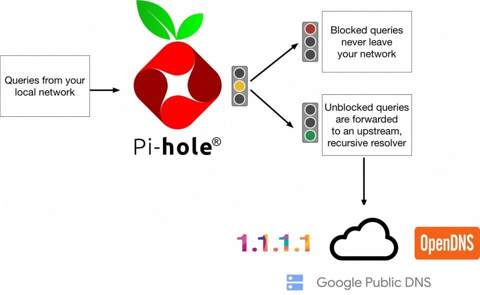

PiHole scans all the DNS queries requested by devices and checks them against a database that has all the information of allowed and blocked domains. All allowed domains are forwarded to the DNS Servers while the blocked DNS queries never leave your network. PiHole is constantly checking these queries against a database, to make things faster, it maintains a DNS cache for allowed and blocked domains. most frequent queries are resolved quickly, improving the network speed.

# Installing PiHole

### Requirements

* A system capable of running Linux
* Debian / Fedora / CentOS / Raspberry Pi OS installed
* 24/7 Power Supply (if PiHole host used a DHCP Server)
* Root / Super User Privileges

### Installation

In this installation, I will be installing PiHole on a Raspberry Pi 4 (4Gb RAM); any Raspberry Pi/system with 512 Mb RAM should be fine.

#### Update and Upgrade the System packages

Since I'm installing PiHole on a fresh install of Raspberry Pi OS, I'll update and upgrade the system packages to have the latest software and security updates using this command.

```bash
sudo apt update && sudo apt upgrade
```

#### Install PiHole via Script

We can install PiHole in three ways. [Installation Methods](https://docs.pi-hole.net/main/basic-install/)

* One line command
* Clone Repository and run the script
* Download the installer and run the script

I'll be using the single line command to install PiHole. To install in any of the three ways, we need specific packages, such as `git, wget, curl`.

```bash
sudo apt install git wget curl
```

After the packages are installed, we can use any of the above methods.

Install via cURLusing this command, PiHole will be installed on the Raspberry Pi.

```bash
curl -sSL https://install.pi-hole.net | bash
```

Initial ConfigurationAs the script runs, we'll get some prompts to make certain decisions and configure PiHole to suit our needs.


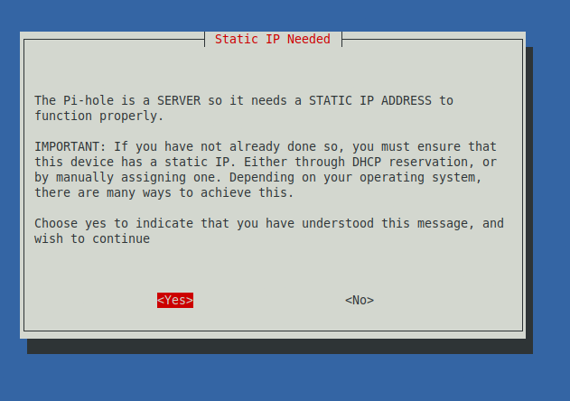

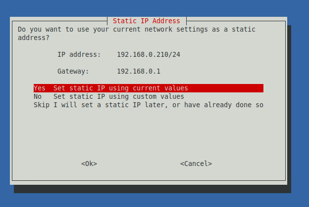

To use PiHole as a DHCP Server, we need a Static IP for the RaspberryPi. A static IP can be set up via a command or router interface. The installation process helps us set the static IP to the default IP the device was assigned to at boot.

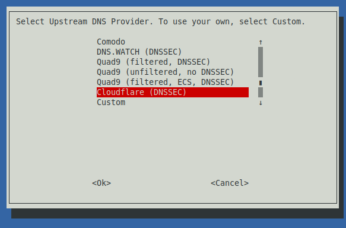

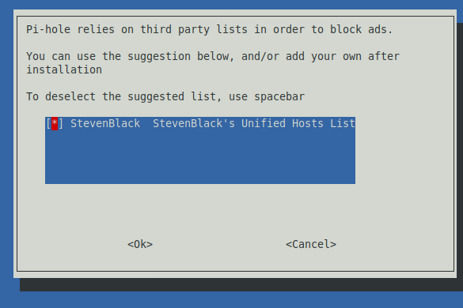

Select the default blocklist (more lists can be added via the Web Interface or CLI)

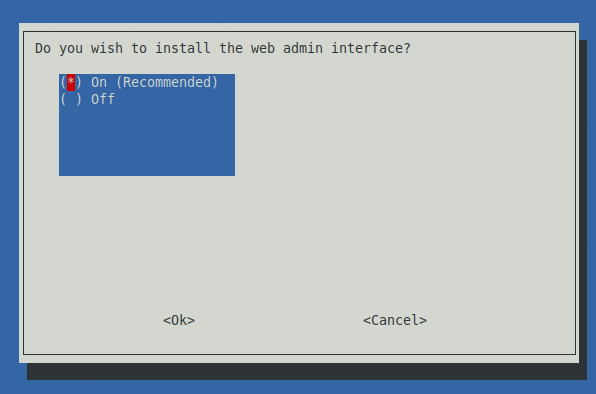

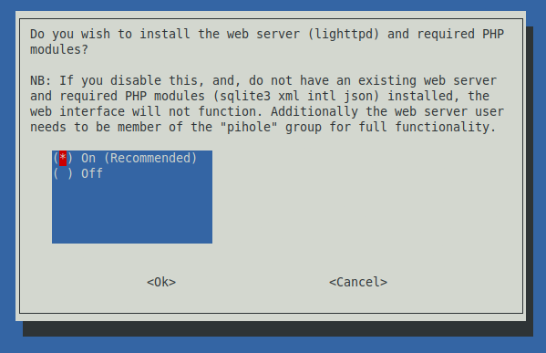

Install Web-Interface, WebServer and PHP Modules

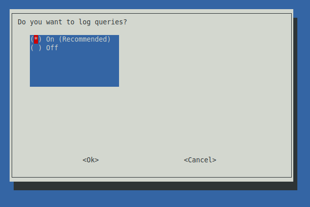


I would like to log my queries to make my own custom blocklist as per my needs; you can choose to disable this if you don't want to log your queries. Choose the level of logging, up to us; I choose ****__'0 -> log everything.'__****

After all the prompts, we get an installation confirmation.

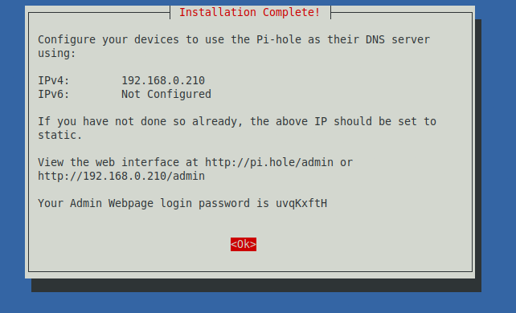

Yay!!! Our PiHole is now successfully installed. Let's access the Web Interface via the browser.

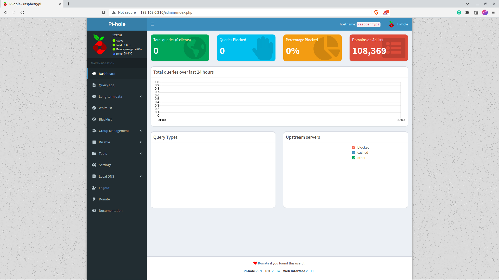

### Setting PiHole as our DHCP Server


A DHCP Host hands out IP addresses to all the devices (clients) connected to the network. It also makes sure that the device requesting the information is served to it securely. By making our PiHole our DHCP Server, all network requests are bound to be processed by the DNS Sinkhole, all the Ads, trackers, spyware and malware are blocked at the network level, the query is not processed, saving us bandwidth and reducing our page/content loading times.

To do this, we need to do things.

* Remove our default router as DHCP Server (Varies by model and manufacturer)
* Make PiHole default DHCP Server.

After the first step is complete, we need to make PiHole our DHCP Server. This can be done by going to `Settings` in the Web Interface. Navigate to the `DHCP` tab and check the `DHCP Server enabled` checkbox; click on save to save the current configuration.

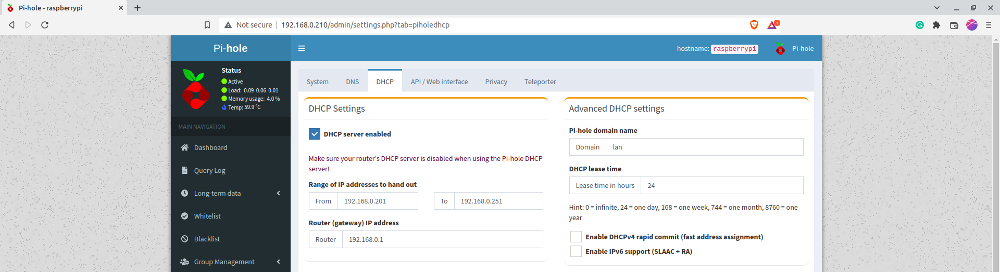

### Adding Block Lists

We can add extra blocklists as per our necessity; we have to ensure that the blocked domains do not break other essential websites. It takes a lot of effort to test and make sure that blocked domains are only blocking unnecessary content, or else we're going to have a cascading effect on our browsing experience. Such blocklists can be found at [firebog.net](https://firebog.net/) where all the blocklists are thoroughly tested, verified, and updated as new domains are discovered. I prefer all the links in green as they're safe.

```txt
https://raw.githubusercontent.com/PolishFiltersTeam/KADhosts/master/KADhosts.txt
https://raw.githubusercontent.com/FadeMind/hosts.extras/master/add.Spam/hosts
https://v.firebog.net/hosts/static/w3kbl.txt

https://adaway.org/hosts.txt
https://v.firebog.net/hosts/AdguardDNS.txt
https://v.firebog.net/hosts/Admiral.txt
https://raw.githubusercontent.com/anudeepND/blacklist/master/adservers.txt
https://s3.amazonaws.com/lists.disconnect.me/simple_ad.txt
https://v.firebog.net/hosts/Easylist.txt
https://pgl.yoyo.org/adservers/serverlist.php?hostformat=hosts&showintro=0&mimetype=plaintext
https://raw.githubusercontent.com/FadeMind/hosts.extras/master/UncheckyAds/hosts
https://raw.githubusercontent.com/bigdargon/hostsVN/master/hosts

https://v.firebog.net/hosts/Easyprivacy.txt
https://v.firebog.net/hosts/Prigent-Ads.txt
https://raw.githubusercontent.com/FadeMind/hosts.extras/master/add.2o7Net/hosts
https://raw.githubusercontent.com/crazy-max/WindowsSpyBlocker/master/data/hosts/spy.txt
https://hostfiles.frogeye.fr/firstparty-trackers-hosts.txt

https://raw.githubusercontent.com/DandelionSprout/adfilt/master/Alternate%20versions%20Anti-Malware%20List/AntiMalwareHosts.txt
https://osint.digitalside.it/Threat-Intel/lists/latestdomains.txt
https://s3.amazonaws.com/lists.disconnect.me/simple_malvertising.txt
https://v.firebog.net/hosts/Prigent-Crypto.txt
https://bitbucket.org/ethanr/dns-blacklists/raw/8575c9f96e5b4a1308f2f12394abd86d0927a4a0/bad_lists/Mandiant_APT1_Report_Appendix_D.txt
https://phishing.army/download/phishing_army_blocklist_extended.txt
https://gitlab.com/quidsup/notrack-blocklists/raw/master/notrack-malware.txt
https://raw.githubusercontent.com/Spam404/lists/master/main-blacklist.txt
https://raw.githubusercontent.com/FadeMind/hosts.extras/master/add.Risk/hosts
https://urlhaus.abuse.ch/downloads/hostfile/

```

I will drop all these links in one go by navigating to `Group Management -> Adlists` paste all the above links to the address text area.

### Updating PiHole Database

After adding the blocklists, we have to let PiHole update its records and block these domains at the next DNS Request. To do this, let's navigate to `Tools -> Update Gravity` and click on `Update` and wait for the process to complete. We should see an increase in the number of blocked domains on the homepage.

After the above steps, we have successfully set up PiHole on our home Network

## Optional Configuration

In the above configuration the `lighttpd` server has been configured to use port `80` by `default`. We would prefer to change the port to the port of our choice.Open the `lighttpd` configuration using the command

```bash
sudo nano /etc/lighttpd/lighttpd.conf
```

change value mentioned in the `server.port` form `80` to the port of your choice, I chose `8000` .

```bash
server.document-root        = "/var/www/html"
server.error-handler-404    = "/pihole/index.php"
server.upload-dirs          = ( "/var/cache/lighttpd/uploads" )
server.errorlog             = "/var/log/lighttpd/error.log"
server.pid-file             = "/run/lighttpd.pid"
server.username             = "www-data"
server.groupname            = "www-data"
server.port                 = 80 # <-- change to 8000
accesslog.filename          = "/var/log/lighttpd/access.log"
accesslog.format            = "%{%s}t|%V|%r|%s|%b"

```

By doing this, we can access the PiHole Web Interface at `http://<ip_address>:8000/admin` port `80` is now free and can be used for other tasks. For the above changes to take place, we need to restart the `lighttpd` service, which can be done by this command.

```bash
sudo systemctl restart lighttpd
```

Our Web Interface is now accessible at `http://192.168.0.210:8000/admin`

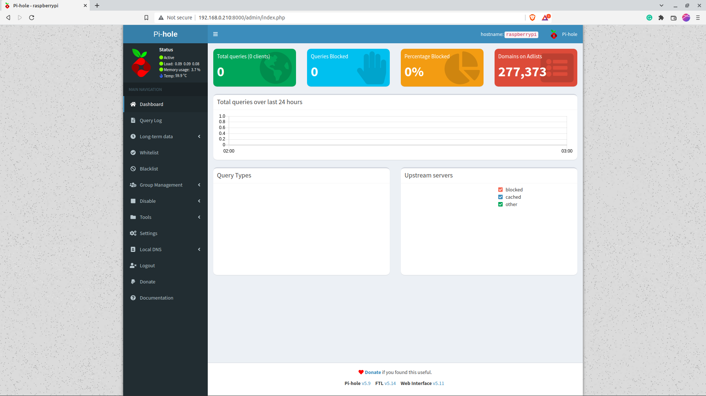

## Conclusion

We have successfully installed PiHole on a RaspberryPi, taken control over our data to some extent, blocked plenty of ads and protected ourselves and our home network from malicious and suspicious websites. I've been using PiHole for the past year, and I can spot the difference between PiHole enabled and PiHole disabled; it's that drastic.I hope this post has been helpful to give ourselves a safer, less annoying browsing experience on our Home Network.

Thank you for reading until the end, and see you next time.~ Kalyan Mudumby

