+++
categories = ["Linux", "open-source", "Cloud", "Raspberry Pi"]
date = 2022-04-02T04:18:09Z
description = ""
draft = false
slug = "pivpn-pihole"
summary = "Let's set up a secure VPN with PiVPN to connect to home/office network block advertisements and trackers, a safer internet connection for ourselves from anyplace outside our home"
tags = ["Linux", "open-source", "Cloud", "Raspberry Pi"]
title = "Let's install a VPN with PiVPN"
[cover]
    image = "images/PiGuard.jpg"


+++


# PiHole

[PiHole](https://pi-hole.net/) is a DNS level AdBlocker that can also function as a DHCP (Dynamic Host Client Protocol) Server that runs on all Linux machines. It can block almost all advertisements on network devices. Created by [Jacob Salmela](https://jacobsalmela.com/) as an open-source alternative to [AdTrap](https://www.kickstarter.com/projects/600284081/adtrap-the-internet-is-yours-again#:~:text=What%20is%20AdTrap%3F,and%20websites%2C%20all%20ad%20free.) in 2014. Installation of PiHole has been Discussed in detail in a previous [Blog Post](https://blog.kalyanmudumby.me/lets-install-pihole/) where we install PiHole on a Raspberry Pi 4 on a home network. In this post, we will be Installing a VPN (Wireguard) to securely connect to a remote Server, mask our traffic, and also block all trackers and advertisements, all while having complete control over our data.

# PiVPN

## What's PiVPN?

[PiVPN](https://www.pivpn.io/) is a program that installs a lightweight OpenVPN server/WireguardVPN tunnel initially designed to run on Raspberry Pi 2 or 3 but can now run on various hardware and software suites. It gives you access to your home/remote network through a secure connection over the internet. It acts somewhat like a bridge between mobile devices and your ISP.

## What is a VPN? Do we need it?

**VPN - Virtual Private Network** gives us online privacy and anonymity. VPNs mask our IP address by redirecting our traffic through a VPN server host; the client traffic appears as traffic from the VPN host, ISP, and third parties cannot see our web activity. A VPN encrypts our data and turns it into gibberish/encrypted data; if anyone were ever to get hold of our data or spy on our traffic, they'd never be able to figure out what we're doing. A VPN has many uses; it can help us get around geo-restricted content on streaming services like Netflix, securely connect to home/work networks, and foremost, it helps us stay safe from suspicious/unprotected/public networks such as public wifi at a local cafe where using online banking or any internet activity that involves our private and sensitive information can be at risk as anyone who has access to the public internet can access our data and online activity, we're highly susceptible to hacks and data theft.

# Installation

I will be installing PiVPN on my remote Ubuntu VM (1GB RAM, 1vCPU); you can install PiVPN on a ubuntu server or your RaspberryPI. To set up a VPN **We must have a Static IP** to securely connect to the machine from the outside world.

## Requirements

* A Static IP
* Machine running Ubuntu Server / Raspberry Pi OS
* Root / Super User privileges

## Install

Let's update our system packages to the latest ones available using.

```bash
sudo apt update && sudo apt upgrade
```

The developers at PiVPN provide a single easy command that runs a script to install all the required packages and dependencies for PiVPN at once.

```bash
sudo curl -L https://install.pivpn.io | bash
```

if cURL isn't installed on your machine, install it using this command

```bash
sudo apt install curl
```

While installation, we will have to set some options so that we get the optimal configuration for our setup

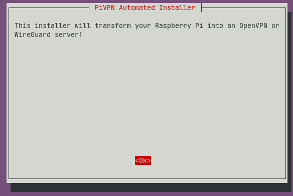

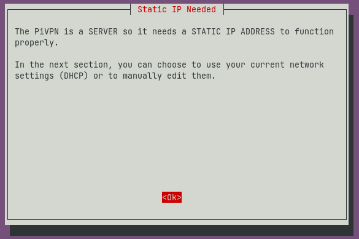

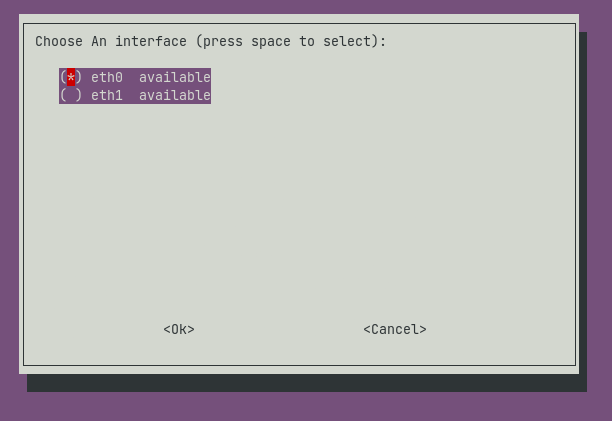

Choose the default interface **eth0** (ethernet)

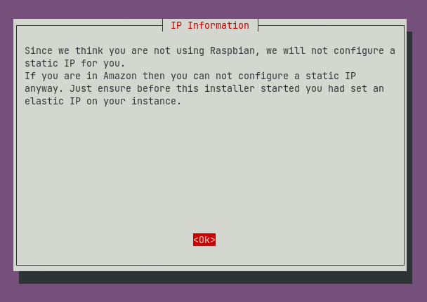

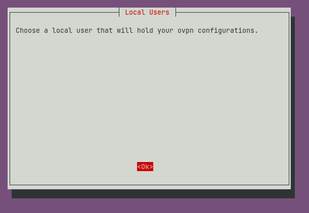

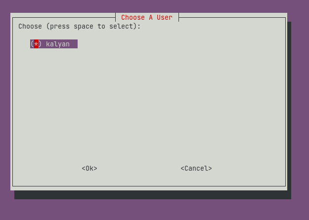

Choose the Linux user for the installation.

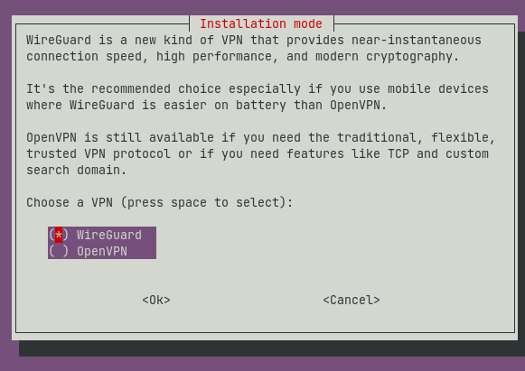

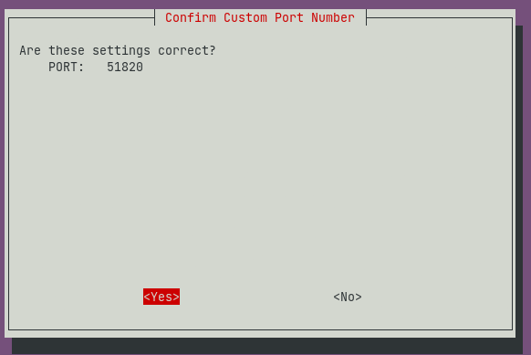

You can continue with the default port or change the port as per your necessity and verify the same

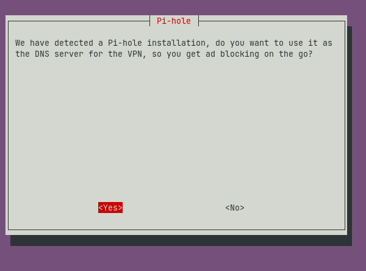

As we have previously installed PiHole on the server, PiVPN has automatically detected PiHole and automatically integrates with it and giving us adblocking on the go by setting up PiHole as our DNS Server.

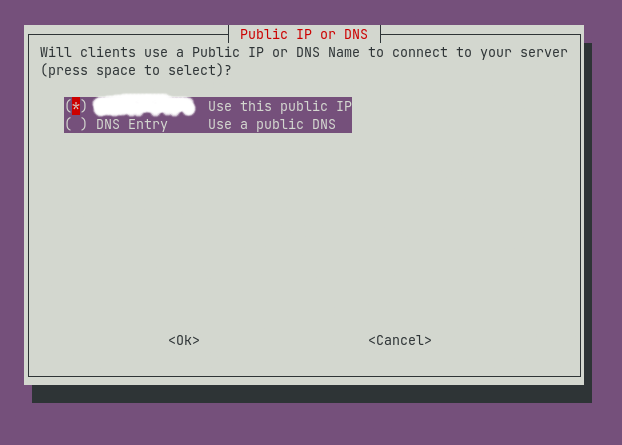

I chose to use my public IP for my clients to connect. You can select a custom DNS name if that suits your needs.

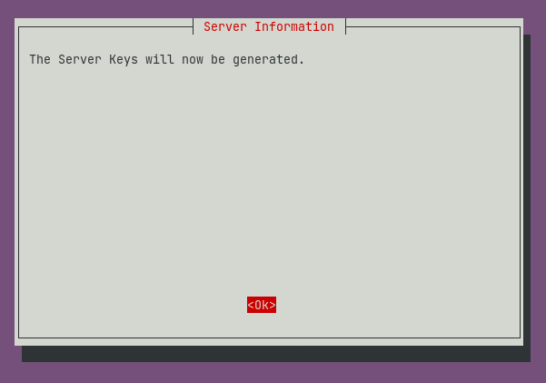

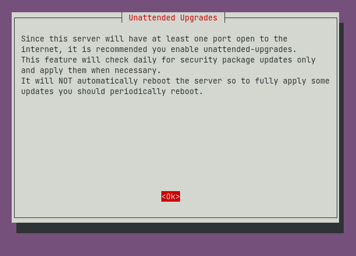

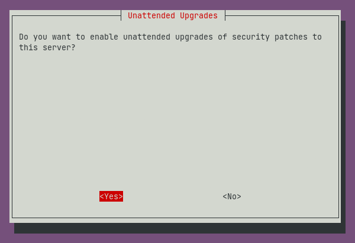

It's better to leave this at default as it can apply some critical security patches it deems necessary.

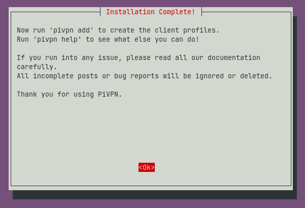

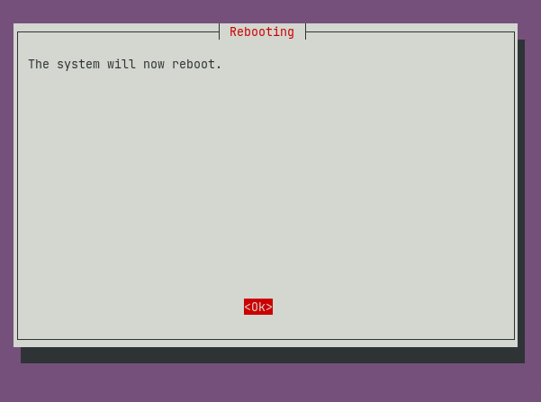

System reboot sets all the changes that have taken place during installation immediately in effect.

## Post-Install

After the installation, we can access our PiVPN using the command `sudo pivpn`

### Create a PiVpn user

PiVPN users can access our VPN via the configuration files. To create a user, use the following command and give the user configuration a name.

### Connect to the VPN

We can connect to our VPN in two ways, using a configuration file or QR code.

#### Using QR Code

To display QR Code, use the following command

```bash
sudo pivpn -qr
```

Select the user and scan the QR Code using the official [Wireguard](https://www.wireguard.com/install/#windows-7-81-10-11-2008r2-2012r2-2016-2019-2022) Android/iOS app from respective stores.

#### Using Config file

```bash
sudo nano ~/configs/<client-name>.conf
```

Copy the configuration and save it to a file with `.conf` extension. Download the official Windows macOS from [Wireguard Website](https://www.wireguard.com/install/#windows-7-81-10-11-2008r2-2012r2-2016-2019-2022).

## Forward all Traffic to Server (IP Forwarding)

To enable both IPv4 and IPv6 IP forwarding, we need to add two lines to `systctl.conf`. Add these two lines to the following file.

```bash
net.ipv4.ip_forward=1
net.ipv6.conf.all.forwarding=1
```

Use this command to save changes and put them in effect right away.

```bash
sudo sysctl -p
```

### Open Wireguard ports

If you're using a firewall like `ufw`, we must open the `wireguard` ports for the traffic to flow to our server. using this command, we can achieve this

```bash
sudo ufw allow 51820/tcp #default-port 
sudo ufw allow 51820/udp #default-port
sudo ufw reload
```

# Other Configuration (Sub Domain for PiHole)

As I'm hosting PiHole on my VM the PiHole UI by default is set to port `80` how to change the port has been discussed [here](https://blog.kalyanmudumby.me/lets-install-pihole/).Now let's set up a subdomain for the Web Interface and also set up SSL using [Let's Encrypt](https://letsencrypt.org/) and Nginx. Let's install the required packages first using the command.

```bash
sudo apt install -y nginx certbot python3-certbot-nginx
```

Create a file `pihole` Use your favourite editor to edit the file, `/etc/nginx/sites-available/` and add the following configuration to the file.

```bash
server {
    server_name pihole.<your_domain>;

    location / {
        proxy_pass http://localhost:<pi_hole_port>/admin; 
        # redirect `/` to `/admin`
        include /etc/nginx/proxy_params;
        proxy_redirect off;
    }
    location /admin {
        proxy_pass http://localhost:<pi_hole_port>/admin;
        include /etc/nginx/proxy_params;
        proxy_redirect off;
    }
}
```

## Enabling HTTPS

By using the following commands, we can enable HTTPS for our subdomain; make sure to replace `me@email` with your email and `mydomain.com` with your subdomain/domain below.

```bash
sudo ln -s ../sites-available/code-server /etc/nginx/sites-enabled/code-server
sudo certbot --non-interactive --redirect --agree-tos --nginx -d mydomain.com -m me@example.com
```

Now you should be able to access PiHole Web Interface at `pihole.<your_domain>` with a secure HTTPS Connection.

# Conclusion

We have successfully set up a VPN that uses the Wireguard tunnel to securely transmit our data to a remote server, mask our IP, use PiHole to block ads trackers; now, we have control over our data to some more extent, in current times, it is crucial to learn and know how our data being used, ignorance is now not an option, so let's all work together towards a digitally secure and safe internet for all.

Thank you for reading until the end, and see you next time.~ Kalyan Mudumby

