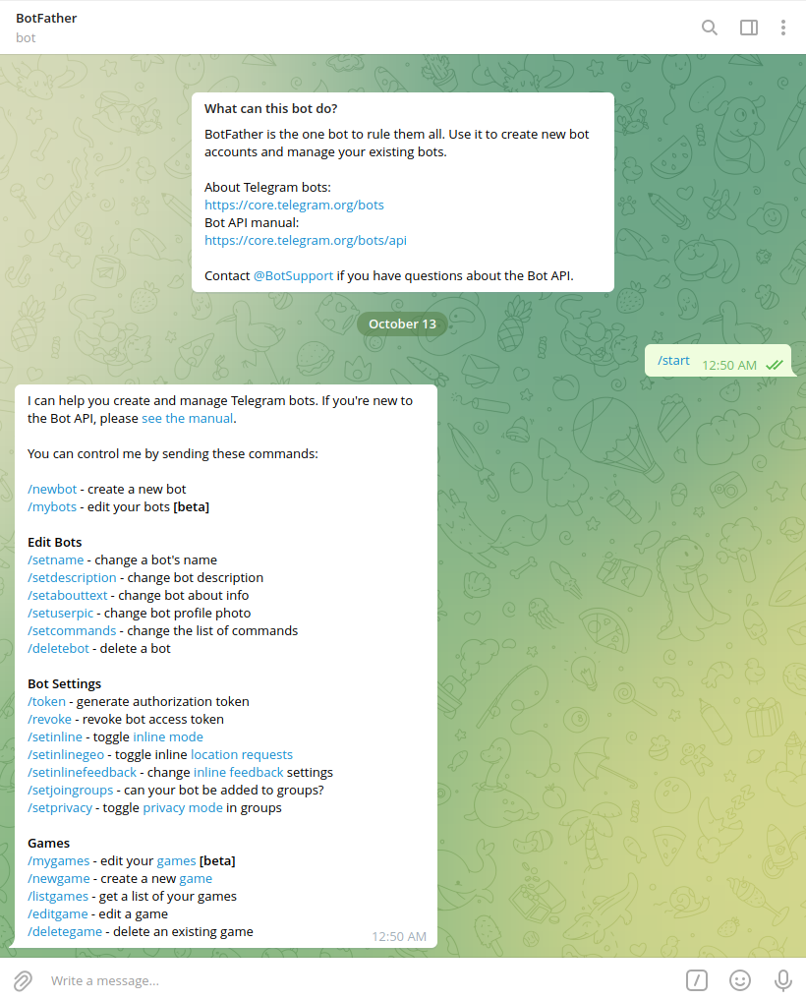
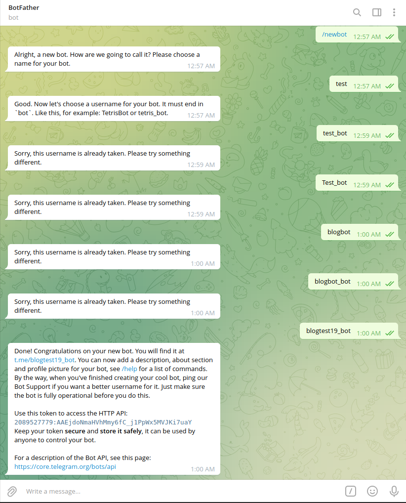
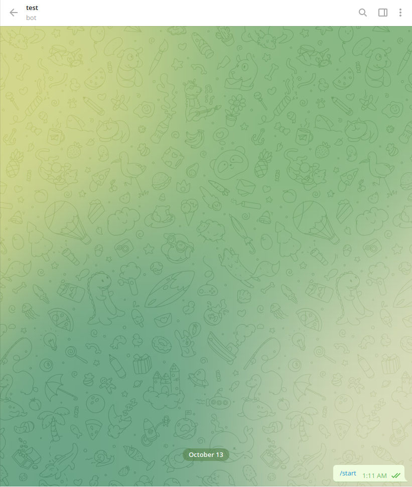

+++
categories = ["telegram", "telegram-bot", "python"]
date = 2021-10-13T13:21:00Z
description = ""
draft = false
title = "Bots! What are they? Let's make a Telegram Bot [Part -1]"
slug = "bots-what-are-they-lets-make-a-telegram-bot-part-1"
tags = ["telegram", "telegram-bot", "python"]
series = ["telegram-bot"]
[cover]
    image = "images/telegram-bot-2.png"

+++

# What are Bots?

Robots for short are called Bots are software programs that performs automated,repetitive,pre-defined tasks for us at a much faster pace, with better accuracy and precision

## Where are Bots used?

Bots are used in various real-life applications where pre-defined tasks have to be done at certain time intervals.We can make a bot for browser to complete a boring task using **[Selenium](https://www.selenium.dev/)**. They can be used to create applications to make our lives a little less boring, we can also create sophisticated programs that can do online payments on our behalf, one such application created a lot of Chaos in the Hardware Industry when all the New Generation Graphics cards from Nvidia and AMD were sold out in minutes after coming in stock, Similarly we can make Trading, Stock Market and Crypto Bot.

## Are Bots safe to use?

In many scenarios using a bot is Safe, depending on the application, using a Bot to send good morning messages is safe, whereas using a Bot to make online purchases on certain platforms can be a problem as you might violate their _Terms and Conditions_, so we should make sure we don’t get into trouble while making such a bot.

# Telegram Bots

Telegram Bots as the name Suggests are Bots that run on Telegram.These are programs created by us users to make bots that run on Telegram’s Infrastructure using Telegram’s [**Bot API**](https://core.telegram.org/bots/api)

## Are Telegram Bots Free?

Yes Telegram Bots are completely free and can be used by Anyone to make their own Custom Bot that is tailored specifically for us. There are many existing bots, have a look at them to understand their interface at the end userHere are some cool Telegram Bots:

* [Urban Dictionary Bot](https://t.me/UrbanDictionaryBot)Search any term or expression in Urban Dictionary just by sending a message to me!
* [αcutєвσt 🐾](https://t.me/acutebot) Get everything related to entrainment! Movies × TVshows × Anime × Music
* [Alert Bot](https://t.me/alertbot) AlertBot has a straightforward but helpful purpose. You can create simple alerts and reminders
* [Gamee](https://t.me/gamee) The best games on Telegram! ❤️ Pick a game and challenge your friends 💪
* [IMDb](https://t.me/imdb) Gets you the IMDb information of any TV Show or Movie

## Getting Ourselves a Bot!

To a get yourself a Bot you have to contact another Bot. Seems cool doesn’t it. It’s very easy and straight forward to get a bot. We have to message **[Bot Father](https://t.me/BotFather)** on Telegram.

We have now successfully Connected with BotFather. Now lets our very own personal Bot, for this issue the Command **/newbot** to BotFather,it will prompt us for a name for the Bot, in my case I’ll be naming it _test_. BotFather will now prompt us to give a unique username for our newly created _test_ Bot.

After a few attempts we’ve got a Bot named **[blogtest19](http://t.me/blogtest19_bot)**, You can visit yours at by clicking on the link or by typing **@<botusername>** , lets visit the bot.

There we go we’ve now have a bot for ourselves 🥳🥳🥳Our Bot is unresponsive as of now as there is no software/script runningOur Bot can be run by scripts that can be run on our local machines or on remote-servers or script-hosting platforms.We will be learning how to make a functional bot in the next post in this series.

