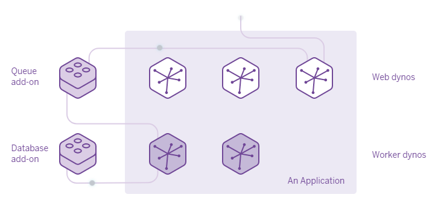
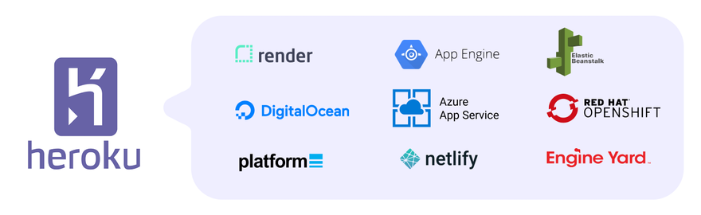

# Recap
In **[PART- 3]** of the series we have made a simple bot that can send songs using Telegram `file_id`, I hope that you've made some changes/added new features/ made a new bot that meets your requirements. By this point, we understand that the bot can only work as long as our machine is online to process the requests, but this method can't keep going on forever. We need to make sure that the bot runs somewhere else and is always available to us. We require a service or a platform that can do this. Heroku is one such platform that provides such a service, and it has some generous limits which is perfect for us.


# What's Heroku?
*"Heroku is a platform as a service (PaaS) that enables developers to build, run, and operate applications entirely in the cloud"*, using Heroku we can define the runtime environment for the application, using a smart container called as `dyno`. A dyno can have a variety of CPU / Memory resources allocated based on the `dyno-type`, We will be using a free dyno in this post to deploy our bot. Dynos can have one/multiple process types to get a task done
## Process Types

All dynos can run different processes in themselves, a free dyno can have 2 and a hobby dyno can have at max 10 processes. We'll be discussing the two main types of processes:
* [Web](#web-process)
* [Worker](#worker-process)

### Web Process
A web process is the one that interacts with incoming HTTP requests from routers and processes the web request or queues the request to be handled by another process, these are mainly web-servers
### Worker Process
A Worker Process is a process that has no connection with the outside world and is generally used to run in the background/process the requests queued by the web process.

# Deploy to Heroku

Applications can be deployed to Heroku using Heroku's GIT versioning control or using GitHub. Git is a mandatory application that should be installed on our machine, Heroku CLI is an optional application that we need if we are using Heroku's Git.

* Create a new app, and select the `Europe` region, as the app will be closer to Telegram BOT API Servers, which will improve the response times of the application.


## Defining process type & runtime
### Worker Configuration
There are no changes to be done for our bot to run as a worker process.
### Web Configuration
As mentioned, a web process can respond to HTTP requests only, in this mode, we need to define a `URL` where the bot will receive requests to be processed, and a `PORT` for the webserver to receive to handle the incoming requests.

Add these following lines to at the top of the file

```python
import os
PORT = int(os.environ.get('PORT', 5000))

# replace this line 
updater.start_polling()
# with
updater.start_webhook(listen="0.0.0.0",
                    port=int(PORT),
                    url_path=TOKEN,
                    webhook_url='https://<your-app-name>.herokuapp.com/' + TOKEN)
```

* Create a `runtime.txt` file and mention the version of python to run the application Ex: `python-3.10.6`

```text
python-3.10.6
```
* Create a `Procfile` file with no extension
* Define the process as either `web` or `worker` and the file to be executed. Ex: 

```Procfile
web: python3 main.py
```

### Deploying using Git
Heroku CLI must be installed for this method.
1. Open CMD and use the command `heroku login`.
2. Login into your Heroku account.
3. Open your working directory and initialize the repo using `git init` and set the remote `heroku git: remote -a <your-app-name>`
4. `git add .`
5. `git commit -m "Initial Commit"`
6. `git push heroku master`
7. To look at the application logs use `heroku logs -t`

With this, we have successfully deployed our application to Heroku using Heroku CLI

### Deploying using GitHub
In the Deploy section connect your project repo on GitHub, everytime you publish changes to the code, the app is re-deployed automatically, without the need of installing Heroku CLI.

# Things to remember
## Storage
Heroku dynos have a *Ephemeral Filesystem* which means that everytime a dyno is deployed/restarted the app starts at the same state as it was at time of deployment. *During the dyno’s lifetime its running processes can use the filesystem as a temporary scratchpad* meaning that there is no data persistence, it is recommended to use Databases to store sensitive/important user-data
## Dyno Hours
Dyno Hours are the number of hours that your dyno can run, the free tier gives us 550 Dynos hours, which is pretty decent, we can get up to 1000 Dyno hours if we verify our account by providing Heroku a valid payment option (will not be charged)
## Free Dynos
Apps deployed as web processes in dynos under the free tier will `sleep` or will go inactive if the application does not receive any requests within 30 minutes of activity, this helps us save our dyno hours, the app will become active as soon as there's a request for the application. Using a worker process the app never sleeps and will run 24/7.
## Dyno restarts
Heroku Docs states that *Dynos are restarted (cycled) at least once per day to help maintain the health of applications running on Heroku. Any changes to the local filesystem will be deleted.* also, dynos are also restarted when the dyno's locations are changed automatically by the dyno manager.
## Worker vs Web
I recommend using a web process as the application sleeps after inactivity if your bot/app needs to be available 24/7 only then a worker process would be beneficial to you, as dyno hours when managed properly can be used to run multiple dynos, providing diff services at once.

# Alternatives to Heroku

If the free tier on Heroku isn't what you need then you can host your app elsewhere like 
* [Digital Ocean App Platform](https://www.digitalocean.com/go/app-platform)
* [Netlify](https://www.netlify.com/)
* [Google App Engine](https://cloud.google.com/appengine)
* [AWS Elastic Beanstalk](https://aws.amazon.com/elasticbeanstalk/)
* By renting a Virtual Machine


# Useful links
* [Heroku](https://www.heroku.com/)
* [Heroku Documentation](https://devcenter.heroku.com/)

# Conclusion
using Heroku **PaaS** (*Platform as a Service*), we've successfully deployed our bot which is now accessible by everyone, I hope that this post was helpful and gives an idea of how to deploy apps to Heroku for testing and production purposes, I've personally used Heroku for about 2 years for my projects it was a great experience and I would recommend the platform to anyone for their initial projects. Although I don't use the platform anymore now, as I've moved to a Virtual Machine for my projects.\
See you next time, until then happy learning :D

~ Kalyan Mudumby