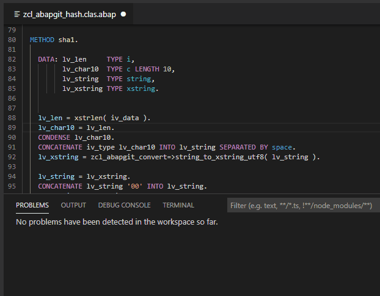
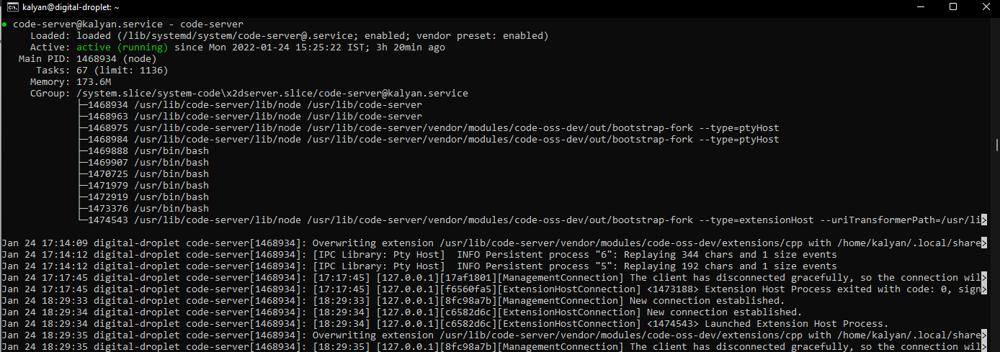
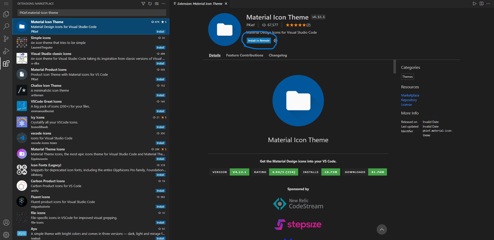

+++
categories = ["open-source", "Cloud", "Linux"]
date = 2022-01-24T09:45:34Z
description = ""
draft = false
slug = "vs-code-on-the-cloud"
summary = "Let's install a Remote VS Code instance on the cloud which can be accessed from anywhere from a browser."
tags = ["open-source", "Cloud", "Linux"]
title = "Let's install VS Code on the Cloud"
[cover]
  image = "images/sigmund-Im_cQ6hQo10-unsplash.jpg"

+++


# Visual Studio Code

[Visual Studio Code](https://code.visualstudio.com/) is an open-source Code Text-Editor by Microsoft and is a popular choice among professionals and beginners. It lets us edit the source code of different languages and install many official and community extensions. Extensions help us become more productive and save time during our coding sessions. Unlike other text editors, VS Code isn't confined to one language, making it versatile and equally powerful as the dedicated IDEs.



## But why cloud?

I code on two separate devices and 4 different environments. We generally code at home or if you're a student at your university or college. To keep my code all in one place, I can zip all the files every time I move between my environments or use a VCS (Version Control System) like GitHub or bitbucket. It's an excellent way solution to the problem, but what if you want to run a simple program on the go from your mobile or a device that doesn't have the compilers or the interpreters installed? Here is where an application that can compile/interpret your code and run the program comes in handy.

## Code-Server

[code-server](https://github.com/coder/code-server) from [Coder](https://coder.com/) is built using the open-source VS Code source-code to provide us with the IDE/text-editor on a browser while the entire processing workload is offloaded to the machine the application is running on. Now we have enabled ourselves to run/compile programs on the go while having the code in one place (Cloud/Self-hosted machine. This is very exciting and will solve my problem to a large extent.

### Installing code-server

Before we continue installing the code-server, there are a few pre-requisites

* A system running a Linux Distribution (preferably Debian)
* 1 GB RAM and 2 CPU Cores

I will be installing code-server on my ubuntu (Debian based) machine that has 1 GB RAM and 1 CPU core, it doesn't meet the minimum requirements, but the workload in my case isn't very CPU or memory-intensive,

#### SSH and updating pacakges

```bash
ssh <username>@<ip_adress of the machine>
```

Now let's update and upgrade our packages.

```bash
sudo apt update && sudo apt upgrade
```

I'll be installing a code-server using a script given in the Github repository.

```bash
curl -fsSL https://code-server.dev/install.sh | sh
```

After the script is installed, you can start the VS code instance using this command `code-server` which starts the server locally on port 8080. You can access the environment with the password given in this file location: `~/.config/code-server/config.yaml` but we still can't access this code-server over the public internet.

#### Configuration

We need to make some configuration changes before exposing our code-server to the internet.Using some commands, we can ensure that our code server starts every time our machine reboots or starts. We need to make our application run as a service, which can be done using this command.

```bash
sudo systemctl enable code-server@<your_username>
```

Now let's start the `code-server` service using this command

```bash
sudo systemctl start code-server@<your_username>
```

Let's see if our `code-server` service is running or not

```bash
sudo systemctl status code-server@<your_username>
```

on using this command, we should get something like this in our terminal



With this our `code-server` service is enabled and running, now let's access this using the web interface.

#### Setting up the Web-Interface

I'll host this on a subdomain on my machine and set up an A Record on my service provider that points to my machine's IP address.

#### Exposing code-server to the internet

To have a secure connection, we'll be setting up a `reverse-proxy` Nginx and a free SSL certificate for HTTPS connection using Certbot from [Let's Encrypt](https://letsencrypt.org/) Organisation. Let's install the required packages using these commands.

```bash
sudo apt install -y nginx certbot python3-certbot-nginx
```

create a file `code-server` using your favourite editor at `/etc/nginx/sites-available/` and add the following configuration to the file.

```bash
server {
    listen 80;
    listen [::]:80;
    server_name <your_domain>;

    location / {
      proxy_pass http://localhost:8080/;
      proxy_set_header Host $host;
      proxy_set_header Upgrade $http_upgrade;
      proxy_set_header Connection upgrade;
      proxy_set_header Accept-Encoding gzip;
    }
}
```

#### Enabling HTTPS

By using the following commands, we can enable HTTPS for our subdomain; make sure to replace `me@email` with your email and `mydomain.com` with your subdomain/domain below.

```bash
sudo ln -s ../sites-available/code-server /etc/nginx/sites-enabled/code-server
sudo certbot --non-interactive --redirect --agree-tos --nginx -d mydomain.com -m me@example.com
```

Now we should access the VS Code Remote Code server at our specified domain.

#### Installing Extensions

Since our Remote VS Code server is running, let's install some good extensions that'll help us do things easier; unlike the traditional VS Code, we cannot install all the extensions on our remote instance of VS Code.

How to install Extensions?Extensions can be installed in two ways, using their unique `extension_id`

* Command Line
* Web Interface

Let's install a [Material Icons](https://open-vsx.org/extension/PKief/material-icon-theme) extension using both methods.

Command Line```bash
code-server --install-extension <extension_id>
```

```bash
code-server --install-extension PKief.material-icon-theme
```

Web InterfaceOpen the Remote VS Code instance on the web and go to the extensions section type the `extension_id` in the search bar and proceed to install the extension; for this particular extension, we need to reload the window



In this way, we can install extensions on our Remote VS Code instance. As previously mentioned, not all extensions are supported. [Open VSX Registry](https://open-vsx.org/) has a collection of all the extensions compatible with our Remote VS Code instance.

### Conclusions

With this, we have successfully installed a Remote VS Code instance on our machine that can run on all browsers and anywhere remotely. With just an internet connection, we can run almost any program in the programming language of our choice.

I hope you found this article interesting and informative. Now even you and I can code on any machine, and our code-base is all in one place. Isn't cloud amazing?Thank you for reading until the end, and see you next time.

